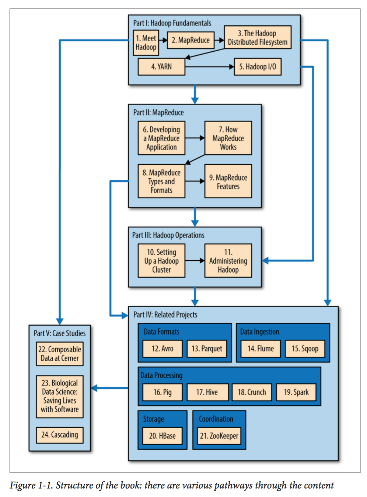

# 大数据理论与实践 - 推荐书籍

## 1. 《数据密集型应用设计》（Designing Data-Intensive Applications）

### 1.1 基本信息

- **作者**: `Martin Kleppmann`
- **原书名**: `Designing Data-Intensive Applications: The Big Ideas Behind Reliable, Scalable, and Maintainable Systems`
- **豆瓣链接**: [《数据密集型应用设计》](https://book.douban.com/subject/30329536/)

**内容概览**：

本书是大数据领域的经典之作，被誉为**分布式系统设计**的**圣经**。全书系统性地介绍了构建可靠、可扩展、可维护的数据密集型应用系统的核心原理和最佳实践。

### 1.2 深度解读资源

- **[《DDIA 逐章精读》小册](https://ddia.qtmuniao.com/#/)**：提供逐章详细解读，帮助读者深入理解书中的核心概念

## 2. 《Hadoop 权威指南》（Hadoop: The Definitive Guide）

### 2.1 基本信息

- **作者**: `Tom White`
- **原书名**: `Hadoop: The Definitive Guide, 4th Edition`
- **豆瓣链接**: [《Hadoop 权威指南》](https://book.douban.com/subject/27600204/)

**内容概览**：

本书是 Hadoop 生态系统的权威指南，详细介绍了 Hadoop 框架的核心组件、运行原理、配置方法以及实际应用场景。它是学习和使用 Hadoop 平台的必备资源。

