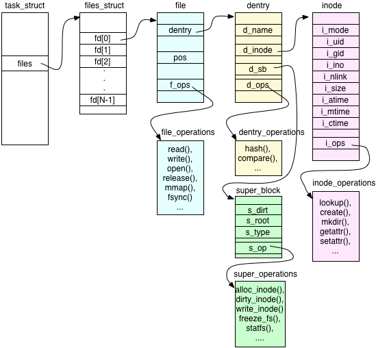
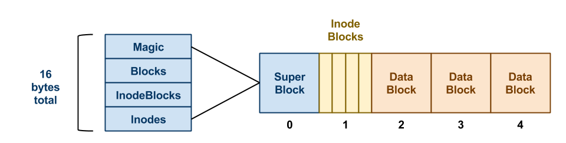

# 从编程视角看 Linux 文件系统

## 一、引言

`Linux` 文件系统是 `Linux` 操作系统的核心组件之一，它为用户和应用程序提供了统一的文件访问接口，屏蔽了底层存储设备的差异。从编程视角来看，理解 `Linux` 文件系统的结构和原理对于开发高效、可靠的文件操作程序至关重要。

## POSIX 接口介绍

**POSIX**（`Portable Operating System Interface`）接口是 `Linux` 系统中用于文件操作的一组标准接口，它为应用程序提供了统一的文件访问方式。以下是一些常用的 `POSIX` 接口：

### 1. open() 接口

`open()` 函数用于打开一个文件，其函数原型为：

```c
int open(const char *pathname, int flags, mode_t mode);
```

- `pathname`：文件路径。
- `flags`：文件打开的标志，如 `O_RDONLY`（只读）、`O_WRONLY`（只写）、`O_RDWR`（读写）等。
- `mode`：当创建新文件时的权限（可选）。**该参数用于指定文件的权限，当创建新文件时生效；对于已存在的文件，`mode` 参数通常被忽略，但某些系统可能会使用它进行权限检查**。

### 2. close() 接口

`close()` 函数用于关闭一个已经打开的文件，其函数原型为：

```c
int close(int fd);
```

- `fd`：文件描述符。

### 3. read() 接口

`read()` 函数用于从文件中读取数据，其函数原型为：

```c
ssize_t read(int fd, void *buf, size_t count);
```

- `fd`：文件描述符。
- `buf`：读取数据的缓冲区。
- `count`：读取的字节数。

### 4. write() 接口

`write()` 函数用于向文件中写入数据，其函数原型为：

```c
ssize_t write(int fd, const void *buf, size_t count);
```

- `fd`：文件描述符。
- `buf`：要写入的数据缓冲区。
- `count`：要写入的字节数。

## 三、Linux 文件编程示例

以下是一个简单的文件读写示例，展示了如何使用 `POSIX` 接口进行文件操作：

```c
#include <fcntl.h>
#include <unistd.h>
#include <stdio.h>
#include <stdlib.h>

int main() {
    int fd;
    char *filename = "example.txt";
    char buf[128];

    // 打开文件
    fd = open(filename, O_RDWR | O_CREAT, 0644);
    if (fd < 0) {
        perror("Failed to open file");
        exit(EXIT_FAILURE);
    }

    // 写入数据
    const char *data = "Hello, Linux file system!";
    ssize_t written = write(fd, data, strlen(data));
    if (written < 0) {
        perror("Failed to write to file");
        close(fd);
        exit(EXIT_FAILURE);
    }

    // 读取数据
    ssize_t read_bytes = read(fd, buf, sizeof(buf));
    if (read_bytes < 0) {
        perror("Failed to read from file");
        close(fd);
        exit(EXIT_FAILURE);
    }

    buf[read_bytes] = '\0';
    printf("Read from file: %s\n", buf);

    // 关闭文件
    close(fd);
    return 0;
}
```

## 四、文件 IO Stack 介绍

`Linux` 文件 `IO Stack` 是一个分层的结构，从用户空间到内核空间再到硬件设备，主要包括以下几个层次：

### 1. LibC 层

`LibC` 是用户空间的标准 `C` 库，它是 `GNU C Library` 的一部分，封装了 `POSIX` 接口，为应用程序提供方便的文件操作函数。例如，`fopen()`、`fread()` 和 `fwrite()` 等函数都是 `LibC` 提供的。

### 2. POSIX 接口层

`POSIX` 接口层定义了标准的文件操作接口，如 `open()`、`close()`、`read()` 和 `write()` 等。这些接口在用户空间和内核空间之间起到了桥梁作用。

### 3. VFS（虚拟文件系统）层

`VFS` 是 `Linux` 内核中的一个抽象层，它为各种具体的文件系统（如 `ext4`、`XFS` 等）提供了统一的接口。

### 4. 具体文件系统层（XFS）

`XFS` 是一种高性能的**基于块的**（Block-based）文件系统。

### 5. 块设备层

块设备层负责与磁盘等存储设备进行交互，实现文件数据的读写操作。它使用块设备驱动程序（`Block Device Driver`）来管理磁盘设备。

## 五、VFS/XFS/Disks 原理介绍

### 1. VFS 数据结构



`VFS` 使用以下关键数据结构来管理文件系统：

- **超级块（super_block）**：存储文件系统的元数据，如文件系统的类型、块大小、块数量等。**超级块是整个文件系统的元数据存储点，包含了文件系统的全局信息，如类型、大小等，是文件系统的核心配置结构**。
- **索引节点（inode）**：存储文件的元数据，如文件大小、权限、创建时间等。**索引节点（`inode`）与文件一一对应，每个文件都有一个唯一的 `inode`，存储了文件的元数据，如文件大小、权限、访问时间等**。
- **目录项（dentry）**：存储文件名和索引节点的映射关系。
- **文件对象（file）**：代表一个打开的文件，是进程与文件交互的接口。

#### 关系

- **超级块（super_block）**：
  - 超级块是整个文件系统的元数据存储点，它包含了文件系统的全局信息，如类型、大小等。通过超级块，`VFS` 可以识别和管理不同的文件系统。

- **索引节点（inode）**：
  - 索引节点（`inode`）与文件一一对应，每个文件都有一个唯一的 `inode`。`inode` 存储了文件的元数据，如文件大小、权限、访问时间等。它是文件系统中文件的抽象表示，不包含文件名。

- **目录项（dentry）**：
  - 目录项（`dentry`）将文件名与 `inode` 连接起来。它存在于目录中，包含文件名和指向该文件 `inode` 的指针。这种映射关系使得用户可以通过文件名访问文件，而文件系统则通过 `inode` 管理文件的实际数据和元数据。

- **文件对象（file）**：
  - 文件对象（`file`）代表一个打开的文件，它是进程与文件交互的接口。`file` 对象包含文件的当前读写位置、文件标志等信息，并通过 `dentry` 和 `inode` 与文件系统中的文件建立联系。

### 2. XFS 原理



XFS 是一种高性能的文件系统，它具有以下特点：

- **日志机制**：XFS 使用日志来记录文件系统的元数据操作，以保证文件系统的完整性。
- **元数据管理**：XFS 使用位图（Bitmap）来管理文件系统的元数据，包括 inode 位图和块位图。
- **数据布局**：XFS 使用块组（Block Group）来组织数据，每个块组包含一定数量的块。**块组可以独立管理，包含数据、元数据和日志信息，用于提高数据存储和访问效率**。

### XFS 在磁盘上的 layout

`XFS` 文件系统在磁盘上的布局通常包括以下几个部分：

1. **超级块（Superblock）**
   - 位于磁盘的固定位置（通常是第 0 块），包含文件系统的元数据，如文件系统版本、UUID、块大小、日志信息等。它是 XFS 文件系统的核心结构，记录了文件系统的整体状态和配置。

   ```c
   struct xfs_super_block {
       __be32 sb_magicnum;       /* 魔术数，用于标识文件系统 */
       __be32 sb_blocksize;      /* 文件系统的块大小 */
       __be64 sb_dblocks;        /* 文件系统中的总块数 */
       __be64 sb_rblocks;        /* 预留块数 */
       __be64 sb_rextents;       /* 预留空间的总扩展数 */
       __u8 sb_uuid[16];         /* 文件系统的 UUID */
       __be32 sb_logstart;       /* 日志区域的起始块号 */
       /* 其他字段 */
   };
   ```

2. **日志区域（Log）**
   - 用于记录文件系统的元数据操作，以保证文件系统的完整性。日志通常位于磁盘的特定区域，可以是内嵌的（位于文件系统内部）或独立的（位于单独的设备上）。

3. **可变长度数据区域（AGF and AGFL）**
   - 可变长度数据区域（`Allocation Group Free and Freelist`）用于管理文件系统的空间分配。它包含每个分配组的空闲空间信息，帮助文件系统高效地分配和回收空间。

4. **B+ 树索引区域（B+ Tree Indexes）**
   - B+ 树索引区域用于快速查找和管理文件系统中的数据。XFS 使用 B+ 树来存储文件的元数据，如 inode 和目录项，以提高数据的访问效率。

5. **用户数据区域（User Data Area）**
   - 这是文件系统中最大的区域，用于存储用户数据。它被划分为多个分配组（`Allocation Groups`），每个分配组包含多个块组（`Block Groups`）。每个块组可以独立管理，包括存储数据、元数据和日志信息。

### 3. 磁盘（Disks）原理

磁盘是一种块设备，它使用块作为基本的存储单位。磁盘的物理结构包括盘片、磁头、磁道和扇区。磁盘的寻址方式包括 `CHS`（`Cylinder-Head-Sector`）地址和 `LBA`（`Logical Block Address`）地址。

## 六、IO Stack 的读写流程

### 1. read 操作流程

1. **用户空间发起 read 请求**：应用程序调用 `read()` 函数，请求从文件中读取数据。
2. **LibC 库处理**：`LibC` 库对 `read()` 请求进行初步封装和处理，如参数检查、缓冲区管理等。
3. **进入内核 POSIX 接口层**：进入内核后，`POSIX` 接口层将请求转交给 `VFS` 层。
4. **VFS 层解析和转发**：`VFS` 层通过文件系统的挂载点信息，确定目标文件所属的具体文件系统类型（如 `XFS`）。
5. **具体文件系统处理读请求**：`XFS` 文件系统根据请求的文件偏移量和大小，从磁盘上读取相应的数据块，并通过缓冲区管理机制将数据传递给 `VFS` 层。**文件系统可能会使用缓存（如页缓存）来提高读取性能**。
6. **VFS 层返回数据**：`VFS` 层将数据返回给 `POSIX` 接口层，再由 `POSIX` 接口层返回给用户空间的 `LibC` 库。
7. **LibC 库返回数据**：`LibC` 库将读取到的数据返回给应用程序，完成整个 `read` 操作流程。

### 2. write 操作流程

1. **用户空间发起 write 请求**：应用程序调用 `write()` 函数，将数据写入文件。
2. **LibC 库处理**：`LibC` 库对 `write()` 请求进行初步封装和处理，如参数检查、缓冲区管理等。
3. **进入内核 POSIX 接口层**：进入内核后，`POSIX` 接口层将请求转交给 `VFS` 层。
4. **VFS 层解析和转发**：`VFS` 层通过文件系统的挂载点信息，确定目标文件所属的具体文件系统类型（如 `XFS`）。
5. **具体文件系统处理写请求**：`XFS` 文件系统接收写入请求，将数据写入缓冲区，并根据需要同步到磁盘。**文件系统可能会使用缓存（如页缓存）来提高写入性能**。
6. **VFS 层处理完成并返回写入结果**：`VFS` 层将写入结果返回给 `POSIX` 接口层，再由 `POSIX` 接口层返回给用户空间的 `LibC` 库。
7. **LibC 库返回结果**：`LibC` 库将写入结果返回给应用程序，完成整个 `write` 操作流程。

## 七、Linux Storage IO Stack


