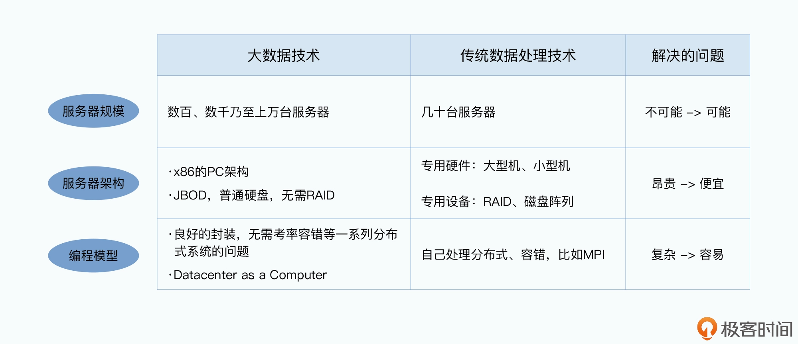
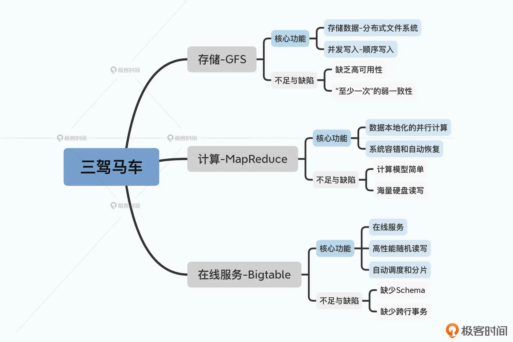
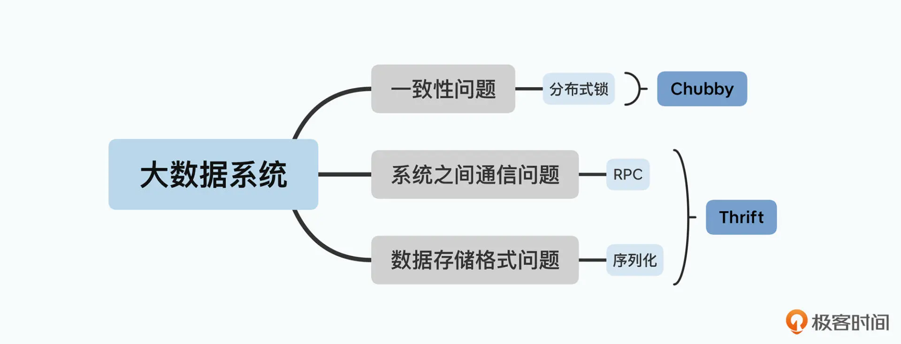
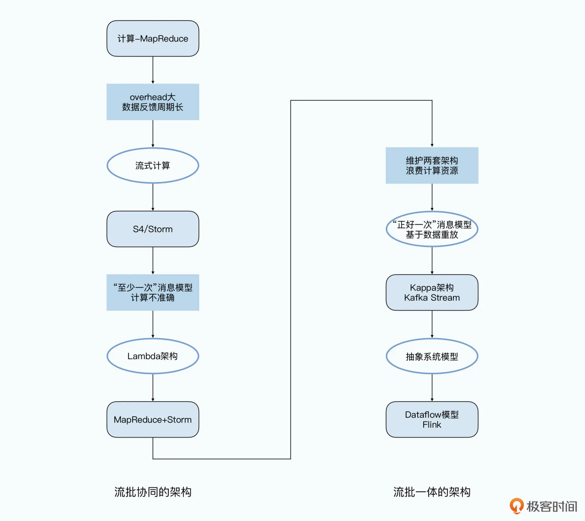
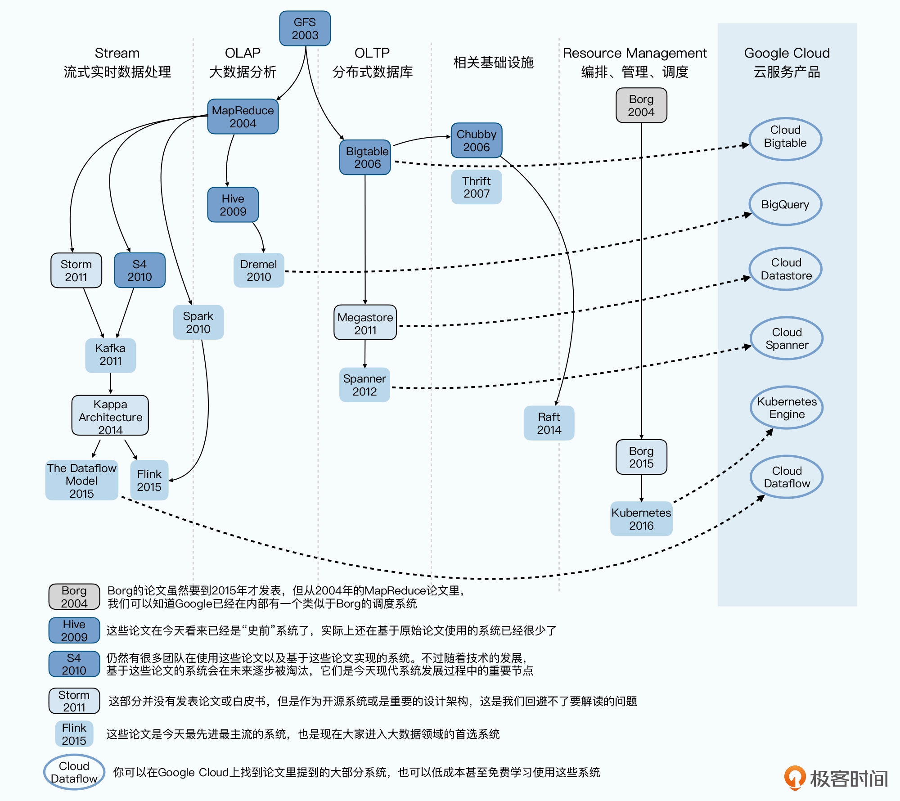

# 什么是大数据：从 GFS 到 Dataflow，12 年大数据生态演化图

在正式开始解读一篇篇论文之前，我想先让你来回答一个问题，那就是"**大数据**"技术到底是什么呢？处理 100GB 数据算是大数据技术吗？如果不算的话，那么处理 1TB 数据算是大数据吗？

"**大数据**"这个名字流行起来到现在，差不多已经有十年时间了。在这十年里，不同的人都按照自己的需要给大数据编出了自己的解释。有些解释很具体，来自于一线写 `Java` 代码的工程师，说用 `Hadoop` 处理数据就是大数据；有些解释很高大上，来自于市场上靠发明大词儿为生的演说家，说我们能采集和处理全量的数据就是大数据，如果只能采集到部分数据，或者处理的时候要对数据进行采样，那就不是大数据。

其实，要想学好大数据，我们需要先正本清源，弄清楚大数据在技术上到底涵盖了些什么。所以今天这节课，我就从大数据技术的**核心理念**和**历史脉络**这两个角度，来带你理解下什么是大数据技术。

通过理解这两点，你就会对大数据技术有一个全面的认识。而这个认识，一方面呢，能让你始终围绕着大数据技术的核心理念，去做好技术开发工作，不至于跑偏；而另一方面呢，它能帮你在学习后面每一个知识点的时候，都能和其他部分建立联系，帮你加深对大数据技术的理解。

好了，那么下面，我们就先来一起看看，大数据的核心理念是什么。

## 大数据技术的核心理念

首先，让我们来看看 `Wikipedia` 里是怎么定义它的。"大数据"是指传统数据处理应用软件时，不足以处理的大的或者复杂的数据集的术语。换句话说，就是技术上的老办法行不通了，必须使用新办法才能处理的数据就叫大数据。不过，这个定义似乎也是一个很模糊的描述性的定义，并没有告诉我们到底哪些技术算是"大数据"技术的范畴。

那么，在我看来，其实"大数据"技术的核心理念是非常清晰的，基本上可以被三个核心技术理念概括。

**第一个，是能够伸缩到一千台服务器以上的分布式数据处理集群的技术。**

在"大数据"这个理念出现之前，传统的并行数据库技术就已经在尝试处理海量的数据了。比如成立于 `1979` 年的 `Teradata` 公司，就是专门做数据仓库的。从公司名字上，你也能看出来这个时候他们就想要处理 TB 级别的数据。但是，这些并行数据库的单个集群往往也就是几十个服务器。

而在 `2003` 年 `Google` 发表了 `GFS` 的论文之后，我们才第一次看到了单个集群里就可以有上千个节点。集群规模有了数量级上的变化，也就把数据处理能力拉上了一个新的台阶。因为集群可以伸缩到上千，乃至上万个节点，让我们今天可以处理 PB 级别的数据，所以微信、 `Facebook` 这样十亿级别日活的应用，也能不慌不忙地处理好每天的数据。

当然，这个数量级上的变化，也给我们带来了大量新的技术挑战。而解决了这些挑战的种种技术方案，就是我们的"大数据"技术。

**第二个，是这个上千个节点的集群，是采用廉价的 PC 架构搭建起来的。**

事实上，今天跑在数据中心里的各个大数据集群，用的硬件设备和我拿来写这节课的笔记本电脑本质上是一样的。可能数据中心里的 `CPU` 强一点、内存大一点、硬盘多一些，但是我完全可以用几台家里的电脑组一个一样的集群出来。

在"大数据"技术里，不需要使用"**神威·太湖之光**"这样的超算，也不用 `IBM` 的大型机或者 `Sun` 公司的 `SPARC` 这样的小型机，同样也不需要 `EMC` 的专用存储设备。"大数据"技术在硬件层面，是完全架设在开放的 `PC` 架构下的，这就让任何一个新创的公司，都能够很容易地搭建起自己的集群。

而且，由于不需要购买昂贵的专属硬件或者存储设备，所以大数据技术很容易地在大大小小的公司之间散播开来，任何一个有兴趣的程序员都可以用自己的 `PC` 开发、测试贡献代码，使得整个技术的生态异常繁荣。

**最后一个，则是"把数据中心当作是一台计算机"（Datacenter as a Computer）。**

要知道，"大数据"技术的目标，是希望对于开发者来说，TA 意识不到自己面对的是一个一千台服务器的集群，而是一台虚拟的"计算机"。使用了部署好的大数据的各种框架之后，开发者能够像面对单台计算机编程一样去写自己的代码，而不需要操心系统的可用性、数据的一致性之类的问题。

所有的"大数据"框架，都希望就算没有"大数据"底层技术知识的工程师，也能很容易地处理海量数据。

大型集群让处理海量数据变得"**可能**"；基于开放的 PC 架构，让处理海量数据变得"**便宜**"；而优秀的封装和抽象，则是让处理海量数据变得"**容易**"。这也是现在谁都能用上大数据技术的基础。可以说，这三个核心技术理念，真正引爆了整个"大数据"技术，让整个技术生态异常繁荣。

## 大数据技术的来龙与去脉

看到这里，你可能要问了，这三个核心技术理念是从哪里来的呢？这些理念当然不是"**机械降神**"，凭空出现的。

事实上，可以说整个"大数据"领域的蓬勃发展，都来自于 Google 这家公司遇到的真实需求。我们今天看到的"大数据"技术，十有八九，都来自于 Google 公开发表的论文，然后再演变成一个个开源系统，让整个行业受益。可以说，Google 是"大数据"领域的普罗米修斯。

而在这个过程中，整个技术的发展也并不是一个直线上升的状态：

- **有争论**，比如 `MapReduce` 的论文发表之后，数据库领域知名科学家**大卫·德维特**（`David DeWitt`）就发表过一篇论文"**MapReduce ： A major step backwards**"，抨击 `MapReduce` 相比于并行数据库是一种倒退；

- **有妥协**，比如，`Bigtable` 不支持跨行事务也不支持 `SQL`，就是一个明证。直到 5 年后发表的 `MegaStore`，他们才开始着手解决这两个问题；

- **更有不成功的尝试**，典型的就是 `Sawzall` 和 `Pig`。 Google 在发表 `MapReduce` 论文之前，就发表了 `Sawzall` 这个用来撰写 `MapReduce` 任务的 `DSL`，`Yahoo` 也很早就完成了对应的开源实现 `Apache Pig`。但是 `10` 年后的今天，我们的主流选择是用 `SQL` 或者 `DataFrame`，`Pig` 的用户已经不多了，而 `Sawzall` 也没有再听 `Google` 提起过。

所以可以说，大数据技术的发展是一个非常典型的技术工程的发展过程，跟随这个脉络，我们可以看到工程师们对于技术的探索、选择过程，以及最终历史告诉我们什么是正确的选择。

那么接下来，我们就一起来看看整个"大数据技术"的历史脉络，一起来看看这一篇篇论文、一个个开源系统都是为什么会出现。

### 需求起源

我认为，`Google` 能成为散播大数据火种的人，是有着历史的必然性的。

作为一个搜索引擎，`Google` 在数据层面，面临着比任何一个互联网公司都更大的挑战。无论是 `Amazon` 这样的电商公司，还是 `Yahoo` 这样的门户网站，都只需要存储自己网站相关的数据。而 `Google`，则是需要抓取所有网站的网页数据并存下来。

而且光存下来还不够，早在 1999 年，两个创始人就发表了 `PageRank` 的论文，也就是说，`Google` 不只是简单地根据网页里面的关键字来排序搜索结果，而是要通过网页之间的反向链接关系，进行很多轮的迭代计算，才能最终确认排序。而不断增长的搜索请求量，让 `Google` 还需要有响应迅速的在线服务。

### 三驾马车和基础设施

由此一来，面对存储、计算和在线服务这三个需求，`Google` 就在 2003、2004 以及 2006 年，分别抛出了三篇重磅论文。也就是我们常说的"大数据"的三驾马车： **GFS**、 **MapReduce** 和 **Bigtable**。

`GFS` 的论文发表于 2003 年，它主要是解决了**数据的存储问题**。作为一个上千节点的分布式文件系统，`Google` 可以把所有需要的数据都能很容易地存储下来。

`MapReduce` 的论文发表于 2004 年，它主要是解决了**数据的计算问题**。通过借鉴 `Lisp`，`Google` 利用简单的 **Map** 和 **Reduce** 两个函数，对于海量数据计算做了一次抽象，这就让"处理"数据的人，不再需要深入掌握分布式系统的开发了。而且他们推出的 `PageRank` 算法，也可以通过多轮的 `MapReduce` 的迭代来实现。

这样，无论是 `GFS` 存储数据，还是 `MapReduce` 处理数据，系统的吞吐量都没有问题了，因为所有的数据都是顺序读写。但是这两个，其实都没有办法解决好数据的高性能随机读写问题。

因此，面对这个问题，2006 年发表的 `Bigtable` 就站上了历史舞台了。它是直接使用 `GFS` 作为底层存储，来做好集群的分片调度，以及利用 `MemTable + SSTable` 的底层存储格式，来解决大集群、机械硬盘下的高性能的随机读写问题。

下图就展示了 `Google` 的三驾马车针对这三类问题的技术优缺点，你可以参考下。

到这里，`GFS`、`MapReduce` 和 `Bigtable` 这三驾马车的论文，就完成了"存储""计算""实时服务"这三个核心架构的设计。不过你还要知道，这三篇论文其实还依赖了两个基础设施。

第一个是为了保障数据一致性的分布式锁。对于这个问题，`Google` 在发表 `Bigtable` 的同一年就发表了实现了 `Paxos` 算法的 `Chubby` 锁服务的论文（我会在基础知识篇"分布式锁 `Chubby`"这一讲中为你详细解读这篇论文）。

第二个是数据怎么序列化以及分布式系统之间怎么通信。 `Google` 在前面的论文里都没有提到这一点，所以在基础知识篇的"通过 Thrift 序列化：我们要预知未来才能向后兼容吗？"我们会一起来看看 `Facebook` 在 2007 年发表的 `Thrift` 的相关论文。

> **小知识**：实际上，`Bigtable` 的开源实现 `HBase`，就用了 `Thrift` 作为和外部多语言进行通信的协议。 `Twitter` 也开源了 `elephant-bird`，使得 `Hadoop` 上的 `MapReduce` 可以方便地使用 `Thrift` 来进行数据的序列化。

### OLAP 和 OLTP 数据库

可以说，`GFS` 、 `MapReduce` 和 `Bigtable` 这三驾马车是为整个业界带来了火种，但是整个大数据领域的进化才刚刚开始。事实上，不管是 `GFS` 也好，`MapReduce` 也好，还是 `Bigtable` 也好，在那个时候，它们都还是很糙的系统设计。

这里，我们先来看下 `MapReduce`，作为一个"计算"引擎，它开始朝着以下方式进化。

> **补充**：作为存储的 `GFS`，`Google` 并没有公开后续的 **Colossus 系统**的论文，而且 `GFS` 要优化的一致性问题，其实在从 `BigTable` 到 `Spanner` 的进化过程中，就已经被彻底讲清楚了，所以在课程里我们就先按下不表了。

**首先是编程模型**。 `MapReduce` 的编程模型还是需要工程师去写程序的，所以它进化的方向就是通过一门 `DSL`，进一步降低写 `MapReduce` 的门槛。

虽然 `Google` 发表了 `Sawzall`，`Yahoo` 实现了 `Pig`，但是在这个领域的第一阶段最终胜出的是 `Facebook` 在 2009 年发表的 `Hive`。 `Hive` 通过一门基本上和 `SQL` 差不多的 `HQL`，大大降低了数据处理的门槛，从而成为了大数据数据仓库的事实标准。

**接着是执行引擎**。 `Hive` 虽然披上了一个 `SQL` 的皮，但是它的底层仍然是一个个 `MapReduce` 的任务，所以延时很高，没法当成一个交互式系统来给数据分析师使用。于是 `Google` 又在 `2010` 年，发表了 `Dremel` 这个交互式查询引擎的论文，采用数据列存储+并行数据库的方式。这样一来，`Dremel` 不仅有了一个 `SQL` 的皮，还进一步把 `MapReduce` 这个执行引擎给替换掉了。

**最后是多轮迭代问题**。在 `MapReduce` 这个模型里，一个 `MapReduce` 就要读写一次硬盘，而且 `Map` 和 `Reduce` 之间的数据通信，也是先要落到硬盘上的。这样，无论是复杂一点的 `Hive SQL`，还是需要进行上百轮迭代的机器学习算法，都会浪费非常多的硬盘读写。

于是和 `Dremel` 论文发表的同一年，来自 `Berkeley` 的博士生**马泰·扎哈里亚**（`Matei Zaharia`），就发表了 `Spark` 的论文，通过把数据放在内存而不是硬盘里，大大提升了分布式数据计算性能。

所以到这里，你可以看到，围绕 `MapReduce`，整个技术圈都在不断优化和迭代计算性能，`Hive` 、 `Dremel` 和 `Spark` 分别从"更容易写程序""查询响应更快""更快的单轮和多轮迭代"的角度，完成了对 `MapReduce` 的彻底进化。

好了，花开两朵，各表一枝。看完了 `MapReduce` 这头，我们再来看看 `Bigtable` 那一头。

作为一个"在线服务"的数据库，`Bigtable` 的进化是这样的：

- **首先是事务问题和 Schema 问题**。 `Google` 先是在 2011 年发表了 `MegaStore` 的论文，在 `Bigtable` 之上，实现了类 `SQL` 的接口，提供了 `Schema`，以及简单的跨行事务。如果说 `Bigtable` 为了伸缩性，放弃了关系型数据库的种种特性。那么 `MegaStore` 就是开始在 `Bigtable` 上逐步弥补关系型数据库的特性。

- **其次是异地多活和跨数据中心问题**。 `Google` 在 2012 年发表的 `Spanner`，能够做到"全局一致性"。这样，就算是基本解决了这两个问题，第一次让我们有一个"全球数据库"。

我在这里放了一张图，你可以看到在大数据领域里，`MapReduce` 和 `Bigtable` 是怎么通过前面说的节点一步步进化下去的。实际上，如果说 `MapReduce` 对应的迭代进化是在不断优化 `OLAP` 类型的数据处理性能，那么 `Bigtable` 对应的进化，则是在保障伸缩性的前提下，获得了更多的关系型数据库的能力。

### 实时数据处理的抽象进化

这样，从 `MapReduce` 到 `Dremel`，我们查询数据的响应时间就大大缩短了。但是计算的数据仍然是固定的、预先确定的数据，这样系统往往有着大到数小时、小到几分钟的数据延时。

所以，为了解决好这个问题，**流式数据处理**就走上了舞台。

首先是 **Yahoo** 在 2010 年发表了 `S4` 的论文，并在 2011 年开源了 `S4`。而几乎是在同一时间，**Twitter** 工程师**南森·马茨**（`Nathan Marz`）以一己之力开源了 `Storm`，并且在很长一段时间成为了工业界的事实标准。和 `GFS` 一样，`Storm` 还支持"**至少一次**"（At-Least-Once）的数据处理。另外，基于 `Storm` 和 `MapReduce`，南森更是提出了 **Lambda 架构**，它可以称之为是第一个"流批协同"的大数据处理架构。

接着在 2011 年，`Kafka` 的论文也发表了。最早的 `Kafka` 其实只是一个"消息队列"，看起来它更像是 `Scribe` 这样进行数据传输组件的替代品。但是由于 `Kafka` 里发送的消息可以做到"**正好一次**"（`Exactly-Once`），所以大家就动起了在上面直接解决 `Storm` 解决不好的消息重复问题的念头。于是，`Kafka` 逐步进化出了 `Kafka Streams` 这样的实时数据处理方案。而后在 2014 年，`Kafka` 的作者 **Jay Kreps** 提出了 **Kappa 架构**，这个可以被称之为第一代"**流批一体**"的大数据处理架构。

看到这里，你会发现大数据的流式处理似乎没有 `Google` 什么事儿。的确，在流式数据处理领域，`Google` 发表的 `FlumeJava` 和 `MillWheel` 的论文，并没有像前面的三驾马车或者 `Spanner` 的影响力那么大。

但是在 2015 年，`Google` 发表的 `Dataflow` 的模型，说是对于流式数据处理模型做出了最好的总结和抽象。一直到现在，`Dataflow` 就成为了真正的"流批一体"的大数据处理架构。而后来开源的 `Flink` 和 `Apache Beam`，则是完全按照 `Dataflow` 的模型实现的了。

这里，我把这些论文的前后之间的脉络联系专门做了一张图，放在了下面。当你对某一篇论文感到困惑的时候，就可以去翻看它前后对应的论文，找到对应问题的来龙去脉。

### 将所有服务器放在一起的资源调度

到了现在，随着"大数据领域"本身的高速发展，数据中心里面的服务器越来越多，我们对于数据一致性的要求也越来越高。

那么，为了解决一致性问题，我们就有了基于 `Paxos` 协议的分布式锁。但是 `Paxos` 协议的性能很差，于是有了进一步的 `Multi-Paxos` 协议。

而接下来的问题就是，`Paxos` 协议并不容易理解，于是就有了 `Raft` 这个更容易理解的算法的出现。 `Kubernetes` 依赖的 `etcd` 就是用 `Raft` 协议实现的，我们在后面的资源调度篇里，会一起来看一下 `Raft` 协议到底是怎么实现的，以及现代分布式系统依赖的基础设施是什么样子的。

然后，也正是因为数据中心里面的服务器越来越多，我们会发现原有的系统部署方式越来越浪费。

原先我们一般是一个计算集群独占一系列服务器，而往往很多时候，我们的服务器资源都是闲置的。这在服务器数量很少的时候确实不太要紧，但是，当我们有数百乃至数千台服务器的时候，浪费的硬件和电力成本就成为不能承受之重了。

于是，尽可能用满硬件资源成为了刚需。由此一来，我们对于整个分布式系统的视角，也从虚拟机转向了容器，这也是 `Kubernetes` 这个系统的由来。在后面的资源调度篇中，我们就会一起来深入看看，`Kubernetes` 这个更加抽象、全面的资源管理和调度系统。

## 小结

最后，我把在这个课程中会解读到的论文清单列在了下面，供你作为一个索引。

| 名称 | 论文来源 | 发表年份 |
|------|----------|----------|
| GFS | The Google File System | 2003 |
| MapReduce | MapReduce: Simplified data processing on large cluster | 2004 |
| Bigtable | Bigtable: A distributed storage system for structured data | 2006 |
| Chubby | The Chubby lock service for loosely-coupled distributed system | 2006 |
| Thrift | Thrift:Scalable cross-language services implementation | 2009 |
| Hive | Hive: a warehousing solution over a map-reduce framework | 2009 |
| Dremel | Dremel: interactive analysis of web-scale datasets | 2010 |
| Spark | Spark: Cluster computing with working sets | 2010 |
| Megastore | Megastore: Providing scalable, highly available storage for interactive services | 2011 |
| Spanner | Spanner: Google's globally distributed database | 2012 |
| S4 | S4: Distributed stream computing platform | 2010 |
| Storm | Storm@Twitter | 2014 |
| Kafka | Kafka: A distributed messaging system for log processing | 2011 |
| Dataflow | The dataflow model: a practical approach to balancing correctness, latency, and cost in massive-scale, unbounded, out-of-order data processing | 2015 |
| RAFT | In search of an understandable consensus algorithm | 2014 |
| Borg | Large-scale cluster management at Google with Borg | 2015 |
| Kubernetes | Borg, Omega, and Kubernetes | 2016 |

我在这节课里提到的这十几篇论文，其实只是 2003 到 2015 年这 12 年的大数据发展的冰山一角。

还有许许多多值得一读的论文，比如针对 `Bigtable`，你就可以还去读一下 `Cassandra` 和 `Dynamo`，这样思路略有不同的分布式数据的论文；针对 `Borg` 和 `Kubernetes`，你可以去看看 `Mesos` 这个调度系统的论文又是什么样的。

网上还有"开源大数据架构的 100 篇论文"这样的文章，如果你想深耕大数据领域，也可以有选择地多读一些其中的论文。

## 推荐阅读

如果你觉得今天的这一讲学完后还不够过瘾，我推荐你可以读一下["Big Data: A Survey"](../../paper/Chen%20等%20-%202014%20-%20Big%20Data%20A%20Survey.pdf)这篇综述文章，可以让你更加深入"大数据"技术的全貌。另外，学完了这门课程之后，如果你还想更加深入地了解更多的大数据技术，你可以对着"`Big Data: A Survey`"这篇论文按图索骥，研读更多里面引用到的论文。

## 课后思考

除了这些论文之外，你觉得还有哪些论文和开源框架，对于大数据领域的发展是有重要贡献的呢？你觉得它们主要是解决了什么样的重要问题？
