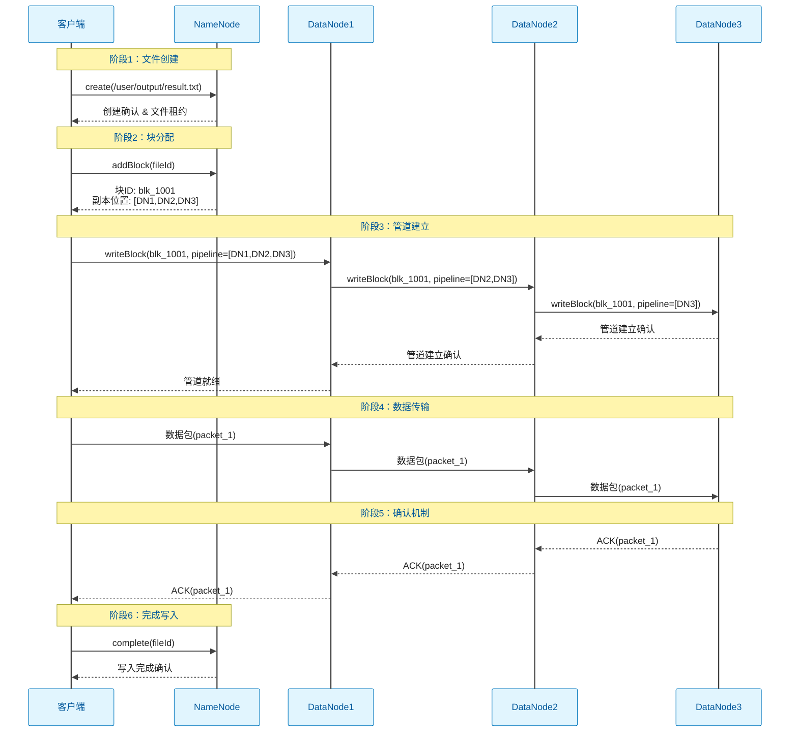
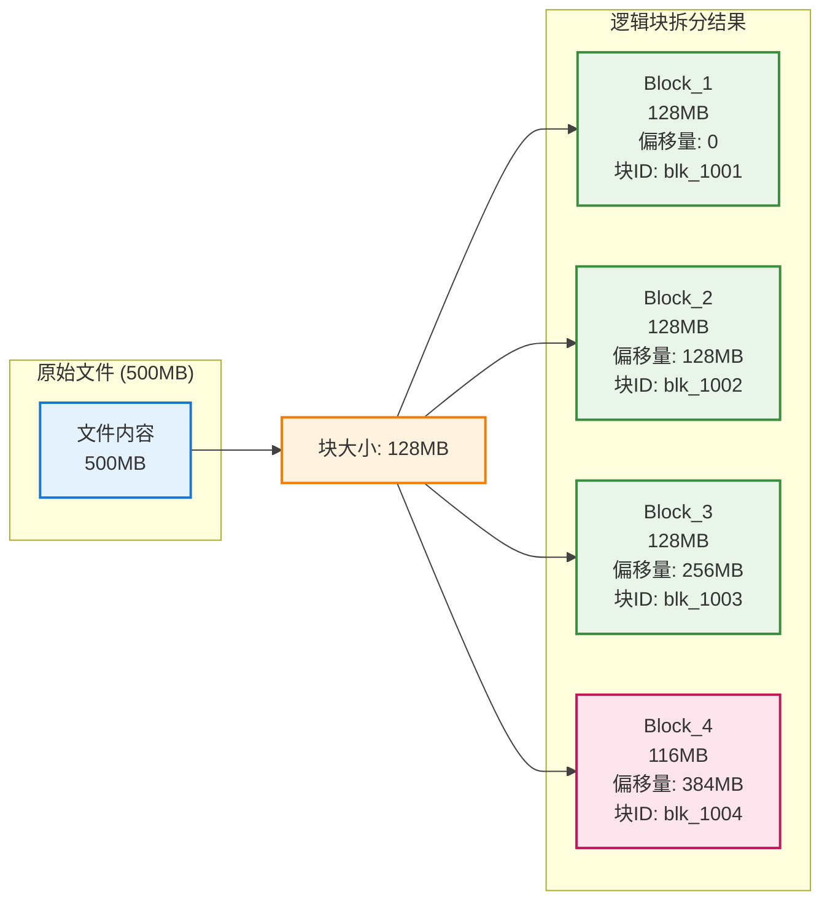
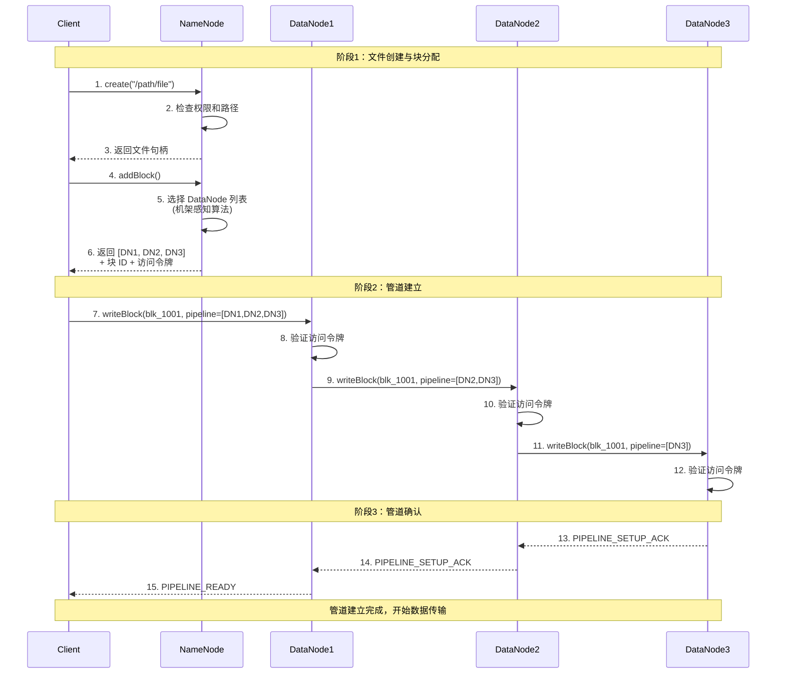
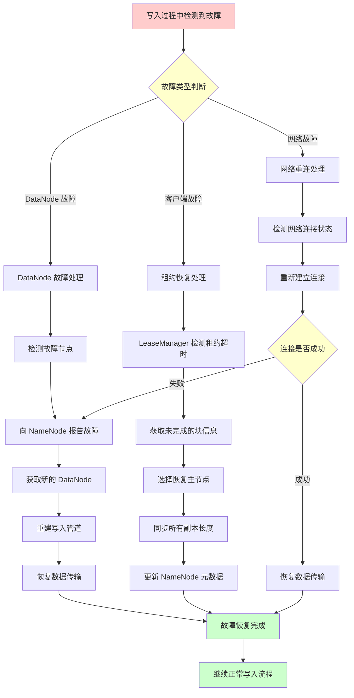
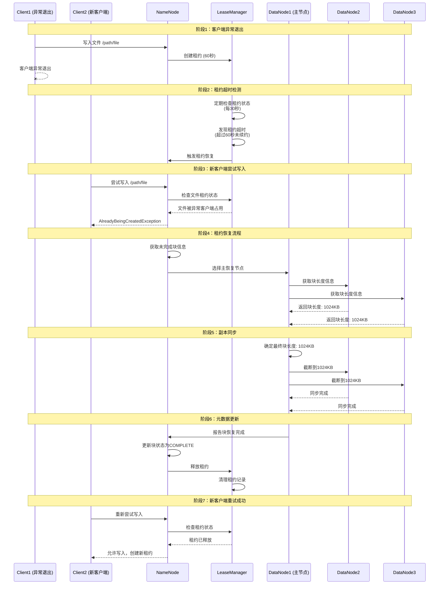

# HDFS 读写流程详解：客户端与 NameNode、DataNode 的交互机制

## 学习目标

通过本文的深入学习，读者将全面掌握：

1. **HDFS 读写架构原理**：理解控制流与数据流分离的设计理念
2. **客户端读取流程**：掌握从文件打开到数据读取的完整交互过程
3. **客户端写入流程**：深入理解文件创建、块分配、管道写入的机制
4. **文件拆分成 Block 的机制**：理解 HDFS 如何将大文件切分成固定大小的数据块
5. **关键数据结构**：熟悉读写过程中涉及的核心数据结构和协议
6. **性能优化策略**：了解读写流程中的性能瓶颈和优化方法
7. **错误处理机制**：掌握读写过程中的容错和恢复策略

> **学习提示**：
> 本章内容较多，建议分阶段学习。每学完一节，停下来思考三个问题：
>
> 1. 这个概念解决了什么问题？
> 2. 如果不这样做会有什么后果？
> 3. 在实际工作中如何应用这个知识？

---

## 术语表

| 术语         | 英文               | 定义                                                                                |
| ------------ | ------------------ | ----------------------------------------------------------------------------------- |
| **NameNode** | NameNode           | HDFS 的主节点，负责管理文件系统的元数据，包括文件目录结构、文件与数据块的映射关系等 |
| **DataNode** | DataNode           | HDFS 的数据节点，负责实际存储数据块，并处理客户端的读写请求                         |
| **数据块**   | Block              | HDFS 将文件切分成的固定大小的数据单元，默认大小为 128MB                             |
| **副本**     | Replica            | 为保证数据可靠性，每个数据块在不同 DataNode 上的多个拷贝                            |
| **副本因子** | Replication Factor | 每个数据块的副本数量，默认为 3                                                      |
| **数据管道** | Pipeline           | 写入数据时，多个 DataNode 形成的数据传输链路                                        |
| **数据包**   | Packet             | 数据传输的基本单位，包含数据和校验信息                                              |
| **校验和**   | Checksum           | 用于验证数据完整性的校验码，HDFS 使用 CRC32 算法                                    |
| **租约**     | Lease              | 客户端对文件的独占写入权限，防止多客户端同时写入同一文件                            |
| **心跳**     | Heartbeat          | DataNode 定期向 NameNode 发送的状态报告                                             |
| **块报告**   | Block Report       | DataNode 向 NameNode 汇报其存储的所有数据块信息                                     |
| **元数据**   | Metadata           | 描述文件系统结构和属性的数据，如文件名、权限、块位置等                              |
| **FSImage**  | FSImage            | NameNode 内存中文件系统元数据的持久化镜像文件                                       |
| **EditLog**  | EditLog            | 记录文件系统所有变更操作的日志文件                                                  |
| **机架感知** | Rack Awareness     | HDFS 根据网络拓扑优化数据放置和访问的策略                                           |
| **安全模式** | Safe Mode          | NameNode 启动时的只读模式，用于检查数据块的完整性                                   |

---

## 1. HDFS 读写架构概述

> **本章导读**
>
> 本章将带领大家认识 HDFS 的整体架构，理解其设计的核心理念。就像建造房屋需要先看建筑蓝图一样，理解架构是掌握 HDFS 读写流程的第一步。
>
> **预备知识**：建议先了解分布式系统的基本概念，如 CAP 理论、数据一致性等。
>
> **学习重点**：
>
> - 控制流与数据流分离的设计思想
> - 这种架构带来的优势和挑战
> - 与传统单体文件系统的区别
>
> **思考引导**：想象你设计一个分布式文件系统，你会如何平衡性能、可靠性和复杂性的关系？

### 1.1 架构设计哲学

HDFS 在读写流程设计上采用了**控制流与数据流分离**的核心架构，这一设计理念源于分布式系统设计的经典原则：将元数据操作与数据传输解耦，以实现更好的性能、可扩展性和可靠性。

**图 1-1 HDFS 读写架构概览**：

```text
┌─────────────────┐    ┌─────────────────┐    ┌─────────────────┐
│     Client      │    │    NameNode     │    │    DataNode     │
│   (应用程序)     │◄──►│  (元数据管理)     │◄──►│  (数据存储)      │
│                 │    │                 │    │                 │
│ ┌─────────────┐ │    │ ┌─────────────┐ │    │ ┌─────────────┐ │
│ │ DFSClient   │ │    │ │ 命名空间     │ │    │ │ 数据块       │ │
│ │ 文件操作API  │ │    │  │ 块映射      │ │    │ │ 副本管理     │  │
│ │ 数据流管理   │  │    │ │ 副本策略     │ │    │ │ 完整性检查   │  │
│ └─────────────┘ │    │ └─────────────┘ │    │ └─────────────┘ │
└─────────────────┘    └─────────────────┘    └─────────────────┘
         ▲                       ▲                       ▲
         │                       │                       │
         └───────────────────────┴───────────────────────┘
                            网络通信
```

### 1.2 控制流与数据流分离

**控制流（Control Flow）**：

- **路径**：Client ↔ NameNode
- **内容**：文件元数据操作、权限验证、块位置信息
- **特点**：数据量小、延迟敏感、频率相对较低
- **协议**：基于 RPC 的 ClientProtocol

**数据流（Data Flow）**：

- **路径**：Client ↔ DataNode
- **内容**：实际的文件数据、校验和、块传输
- **特点**：数据量大、吞吐量敏感、持续传输
- **协议**：基于 TCP 的 DataTransferProtocol

**协议族综述**：

- ClientProtocol：客户端与 NameNode 的控制流接口（创建文件、获取块位置等）
- DatanodeProtocol：DataNode 与 NameNode 的管理接口（注册、心跳、块报告等）
- InterDatanodeProtocol：DataNode 之间的协调接口（副本一致性、控制消息）
- DataTransferProtocol：客户端/数据节点与 DataNode 的数据通道协议（块读写、数据包传输）

**分离设计的优势**：

**表 1-1 控制流与数据流分离的技术优势**：

| **优势维度** | **具体表现**                     | **技术价值**             |
| ------------ | -------------------------------- | ------------------------ |
| **性能优化** | NameNode 不参与数据传输          | 避免元数据服务器成为瓶颈 |
| **可扩展性** | 数据传输能力随 DataNode 线性扩展 | 支持大规模并发访问       |
| **容错性**   | 控制流失败不影响已传输的数据     | 提高系统整体可用性       |
| **网络优化** | 数据可直接在最优路径上传输       | 减少网络跳数和延迟       |

### 1.3 读写流程的一致性模型

HDFS 在读写流程中实现了**强一致性**的元数据操作和**最终一致性**的数据副本同步：

**元数据一致性**：

- 所有对文件系统命名空间的操作都通过 NameNode 串行化执行
- 采用写锁机制保证元数据操作的强一致性
- 文件属性、权限等信息的变更对所有客户端立即可见

**数据一致性**：

- 采用**单写者模型**：同一时间只允许一个客户端写入文件
- 实现**写后读一致性**：文件关闭后，所有客户端都能看到完整数据
- 副本间通过异步复制达到最终一致性

---

## 2. HDFS 读取流程详解

> **本章导读**
>
> 本章将深入剖析 HDFS 的读取机制，这是理解 HDFS 工作原理的关键环节。读取流程体现了分布式系统的核心挑战：如何在复杂的网络环境中高效、可靠地获取数据。
>
> **学习价值**：
>
> - **性能优化基础**：理解读取流程有助于优化应用程序的数据访问模式
> - **故障排查能力**：掌握读取机制能快速定位和解决读取性能问题
> - **设计思维培养**：学习如何在分布式环境下实现高效的数据访问
>
> **学习建议**：
>
> 1. **跟随流程图学习**：结合时序图理解每个步骤的作用
> 2. **关注异常处理**：重点理解系统如何处理各种故障情况
> 3. **思考优化策略**：每个环节都存在优化空间，思考可能的改进方案
>
> **实践任务**：尝试用 Java 编写一个简单的 HDFS 文件读取程序，观察控制台输出的日志信息，验证本章学到的理论知识。

### 2.1 读取流程概览

> **概念导入**
>
> 在开始学习具体的读取流程之前，让我们先思考一个问题：**在分布式环境中读取文件与在本地文件系统中读取文件有什么本质区别？**
>
> **关键差异**：
>
> - **网络通信**：分布式读取需要跨网络获取数据，引入了网络延迟和不确定性
> - **数据位置选择**：需要选择最优的数据副本，这涉及到复杂的策略
> - **容错处理**：必须处理节点故障、网络故障等各种异常情况
> - **一致性保证**：需要确保读取到的数据是正确的、完整的
>
> **学习重点**：重点关注 HDFS 如何解决这些挑战，以及这些解决方案背后的设计思想。

HDFS 的读取流程是一个多阶段、分布式的协作过程，涉及客户端、NameNode 和 DataNode 之间的精密配合。

**图 2-1 HDFS 读取流程时序图**：

```text
Client                    NameNode                    DataNode
  │                         │                           │
  │───── getFileInfo() ────►│                           │
  │◄──────── 文件元数据 ──────│                           │
  │                         │                           │
  │── getBlockLocations() ─►│                           │
  │◄──────── 块位置信息 ─ ────│                           │
  │                         │                           │
  │───── readBlock() ──────────────────────────────────►│
  │◄─────────────────────────────── 块数据 ──────────────│
  │                         │                           │
  │───── readBlock() ──────────────────────────────────►│
  │◄─────────────────────────────── 块数据 ──────────────│
  │                         │                           │
```

### 2.2 读取流程详细步骤

#### 2.2.1 文件元数据获取阶段

**步骤 1：客户端初始化文件系统操作**：

```java
// 客户端代码示例
// 版本兼容性说明：
// - Hadoop 1.x: 基础 FileSystem API
// - Hadoop 2.x: 增加了 HA 支持，Configuration 可以自动发现 NameNode
// - Hadoop 3.x: 支持多 NameNode 服务，增强了客户端容错能力

Configuration conf = new Configuration();
// Hadoop 2.x+ 支持 HA 配置
// conf.set("dfs.nameservices", "mycluster");
// conf.set("dfs.ha.namenodes.mycluster", "nn1,nn2");

FileSystem fs = FileSystem.get(conf);  // 自动选择可用的 NameNode (Hadoop 2.x+)
Path filePath = new Path("/user/data/largefile.txt");

// Hadoop 3.x+ 支持更多的打开选项
// EnumSet<ReadOption> readOptions = EnumSet.of(ReadOption.SKIP_CHECKSUMS);
// FSDataInputStream in = fs.open(filePath, readOptions);
FSDataInputStream in = fs.open(filePath);
```

**步骤 2：NameNode 元数据查询**：

客户端通过 RPC 调用向 NameNode 发送文件信息查询请求：

```java
// ClientProtocol 接口定义
// 版本兼容性说明：
// - Hadoop 1.x: 基础接口，支持基本的文件操作
// - Hadoop 2.x: 增加了 HA 支持，添加了 failover 相关方法
// - Hadoop 3.x: 增强了安全性，支持更多的文件属性查询
public interface ClientProtocol {
    /**
     * 获取文件状态信息
     * @since Hadoop 0.20
     */
    FileStatus getFileInfo(String src) throws IOException;

    /**
     * 获取文件块位置信息
     * @since Hadoop 0.20
     * @param src 文件路径
     * @param offset 起始偏移量
     * @param length 读取长度
     * @return 块位置列表
     *
     * 版本差异：
     * - Hadoop 2.x+: 支持缓存块位置信息
     * - Hadoop 3.x+: 增加了 EC (Erasure Coding) 块的支持
     */
    LocatedBlocks getBlockLocations(String src, long offset, long length);
}
```

**NameNode 处理流程**：

1. **权限验证**：检查客户端对目标文件的读取权限
2. **命名空间查找**：在内存中的目录树结构中定位文件
3. **元数据组装**：收集文件大小、创建时间、权限等属性信息
4. **块位置计算**：根据文件偏移量和长度确定涉及的块列表

**步骤 3：块位置信息返回**：

NameNode 返回 `LocatedBlocks` 对象，包含以下关键信息：

**表 2-1 LocatedBlocks 数据结构**：

| **字段**            | **类型**            | **描述**         |
| ------------------- | ------------------- | ---------------- |
| fileLength          | long                | 文件总长度       |
| isUnderConstruction | boolean             | 文件是否正在写入 |
| locatedBlocks       | List\<LocatedBlock> | 块位置列表       |

**LocatedBlock 详细信息**：

```java
public class LocatedBlock {
    private ExtendedBlock block;        // 块标识信息
    private long offset;                // 块在文件中的偏移量
    private DatanodeInfo[] locations;   // 存储该块的 DataNode 列表
    private boolean isCorrupt;          // 块是否损坏
    private Token<BlockTokenIdentifier> blockToken; // 访问令牌
}
```

#### 2.2.2 最优 DataNode 选择策略

HDFS 采用**机架感知**的数据本地性优化策略选择最优的 DataNode：

**选择优先级**：

1. **本地 DataNode**：如果客户端运行在 DataNode 上，优先选择本地副本
2. **同机架 DataNode**：选择同一机架内的 DataNode，减少网络跳数
3. **负载均衡考虑**：避免选择当前负载过高的 DataNode
4. **网络拓扑距离**：根据网络拓扑计算选择网络距离最近的副本

**机架感知算法**：

```java
// 网络拓扑距离计算
public int getDistance(Node node1, Node node2) {
    // 计算两个节点在网络拓扑中的距离
    // 通常基于机架、交换机层级等因素
    return networkTopology.getDistance(node1, node2);
}
```

#### 2.2.3 数据块读取过程

**步骤 1：建立数据连接**:

客户端与选定的 DataNode 建立 TCP 连接，使用 DataTransferProtocol 进行数据传输：

```java
// DataTransferProtocol 协议定义
// 版本兼容性说明：
// - Hadoop 1.x: 基础数据传输协议，支持基本的读写操作
// - Hadoop 2.x: 增加了短路读取 (Short-circuit reads) 支持
// - Hadoop 3.x: 增强了安全性，支持加密传输和 EC 编码
public interface DataTransferProtocol {
    /**
     * 读取数据块
     * @since Hadoop 0.20
     * @param block 目标数据块
     * @param blockOffset 块内偏移量
     * @param length 读取长度
     *
     * 版本差异：
     * - Hadoop 2.x+: 支持短路读取，绕过网络直接访问本地文件
     * - Hadoop 3.x+: 支持 EC 块的读取和重建
     */
    void readBlock(Block block, long blockOffset, long length);

    /**
     * 写入数据块
     * @since Hadoop 0.20
     * @param block 目标数据块
     * @param targets 目标 DataNode 列表
     *
     * 版本差异：
     * - Hadoop 2.x+: 优化了管道建立机制，支持更快的故障恢复
     * - Hadoop 3.x+: 支持 EC 编码写入，减少存储开销
     */
    void writeBlock(Block block, DatanodeInfo[] targets);
}
```

**步骤 2：数据传输协议**:

数据传输采用**基于数据包**的传输机制：

**表 2-2 HDFS 数据包结构定义**:

| **字段**          | **长度** | **描述**                       |
| ----------------- | -------- | ------------------------------ |
| packetLen         | 4 bytes  | 数据包总长度（包含所有字段）   |
| offset            | 8 bytes  | 数据在块中的偏移量             |
| seqno             | 8 bytes  | 数据包序列号（用于排序和确认） |
| lastPacketInBlock | boolean  | 是否为块中的最后一个数据包     |
| dataLen           | 4 bytes  | 实际数据长度                   |
| data              | variable | 实际数据内容                   |
| checksum          | 4 bytes  | 数据校验和（CRC32）            |

> **注意**：写入流程中会在此基础上增加 `ackSeqno` 字段用于确认机制（详见第 3.3.4 节）。

**步骤 3：校验和验证**:

每个数据包都包含校验和信息，客户端在接收时进行完整性验证：

```java
// 校验和验证过程
private void verifyChecksum(byte[] data, int checksum) {
    int calculatedChecksum = calculateChecksum(data);
    if (calculatedChecksum != checksum) {
        throw new ChecksumException("Data corruption detected");
    }
}
```

#### 2.2.4 错误处理与故障恢复

**DataNode 故障检测**：

```java
// 读取超时处理
private byte[] readBlockWithRetry(LocatedBlock block, long offset) {
    for (DatanodeInfo datanode : block.getLocations()) {
        try {
            return readFromDataNode(datanode, block, offset);
        } catch (IOException e) {
            // 记录失败，尝试下一个 DataNode
            LOG.warn("Failed to read from " + datanode + ", trying next");
            continue;
        }
    }
    throw new IOException("All datanodes failed");
}
```

**故障恢复策略**：

1. **自动重试**：检测到 DataNode 故障时自动尝试其他副本
2. **黑名单机制**：将频繁失败的 DataNode 加入临时黑名单
3. **NameNode 报告**：向 NameNode 报告损坏的块信息
4. **客户端缓存更新**：更新本地缓存的块位置信息

### 2.3 读取流程性能优化

#### 2.3.1 预读取机制

HDFS 客户端实现了**智能预读取**机制，提前获取可能需要的数据：

```java
// 预读取实现
public class DFSInputStream {
    private byte[] buffer;          // 预读取缓冲区
    private long bufferOffset;      // 缓冲区起始偏移

    private void prefetch() {
        // 根据访问模式预测下一个需要读取的块
        long nextBlockOffset = getNextPredictedOffset();
        if (shouldPrefetch(nextBlockOffset)) {
            prefetchBlock(nextBlockOffset);
        }
    }
}
```

#### 2.3.2 数据本地性优化

**短路读取（Short-Circuit Read）**：

当客户端与 DataNode 在同一节点时，可直接读取本地文件，避免网络传输：

```java
// 短路读取实现
if (isShortCircuitReadEnabled() && isLocalDataNode(datanode)) {
    // 直接读取本地文件
    return readLocalBlock(block, offset, length);
} else {
    // 通过网络读取
    return readRemoteBlock(datanode, block, offset, length);
}
```

---

## 3. HDFS 写入流程详解

> **本章导读**
>
> 写入流程是 HDFS 的核心功能之一，它体现了分布式系统的复杂性：如何确保数据在多个节点间可靠、高效地复制，同时保持一致性。
>
> **学习价值**：
>
> - **数据可靠性保障**：理解 HDFS 如何保证数据不丢失
> - **性能优化思路**：掌握写入流程有助于优化写入性能
> - **故障恢复机制**：学习系统在写入过程中如何处理各种故障
>
> **学习挑战**：
> 写入流程比读取流程更复杂，因为它涉及到数据复制、一致性保证、故障恢复等多个方面。建议学习者：
>
> 1. **分阶段学习**：将复杂的写入流程分解为多个小步骤
> 2. **关注关键决策点**：理解每个关键决策背后的原因
> 3. **对比单机系统**：思考分布式写入与单机写入的本质区别
>
> **实践建议**：
>
> - 使用 HDFS 提供的工具观察写入过程
> - 尝试修改副本因子，观察对写入性能的影响
> - 模拟节点故障，验证系统的容错能力

### 3.1 写入流程概览

> **概念导入**
>
> 在分布式系统中，**写入操作比读取操作复杂得多**。让我们思考几个关键问题：
>
> **核心挑战**：
>
> 1. **数据一致性**：如何确保所有副本的数据是一致的？
> 2. **故障处理**：写入过程中某个节点故障怎么办？
> 3. **性能平衡**：如何在数据可靠性和写入性能之间取得平衡？
> 4. **网络效率**：如何最小化网络传输开销？
>
> **HDFS 的解决思路**：
>
> - **管道式写入**：数据像流水一样在多个节点间传递
> - **副本机制**：通过多副本保证数据可靠性
> - **租约机制**：防止多个客户端同时修改同一个文件
> - **校验和**：确保数据传输的正确性
>
> **学习重点**：理解每个设计决策背后的权衡考虑。

HDFS 的写入流程比读取流程更为复杂，涉及文件创建、块分配、副本管道建立和数据传输等多个阶段。

### 3.2 文件拆分成 Block 的机制

HDFS 的写入流程比读取流程更为复杂，涉及文件创建、块分配、副本管道建立和数据传输等多个阶段。在深入了解具体步骤之前，我们需要理解 HDFS 如何将文件拆分成固定大小的数据块（Block），这是 HDFS 分布式存储的基础机制。

#### 3.2.1 Block 拆分原理

HDFS 采用**固定大小块拆分**策略，默认块大小为 128MB（可配置；Hadoop 1.x 默认 64MB）。文件被逻辑上划分为多个等大小的块，最后一个块可能小于指定大小。

**图 3-1 HDFS 写入流程时序图**:



**图 3-2 文件拆分成 Block 的可视化过程**:



**文件拆分过程说明**:

1. **原始文件**：500MB 大小的文件在逻辑上被视为一个整体
2. **块大小设定**：HDFS 默认块大小为 128MB（可配置；Hadoop 1.x 默认 64MB）
3. **逻辑拆分**：文件按固定大小被拆分成多个块
4. **最后一块**：最后一块可能小于设定大小（本例为 116MB）

#### 3.2.2 小文件处理机制

**重要说明**：HDFS **不会**将多个小文件合并到一个 Block 中。每个文件都是独立的，无论大小都会占用至少一个 Block。

**小文件问题**:

- **NameNode 内存压力**：每个文件都需要元数据，大量小文件会耗尽 NameNode 内存
- **空间浪费**：小文件无法充分利用 Block 空间
- **处理效率低**：MapReduce 等计算框架处理小文件时性能下降

**解决方案**:

- **HDFS Archive (HAR)**：将小文件打包成大文件
- **SequenceFile**：将小文件合并为键值对格式
- **CombineFileInputFormat**：在计算层合并小文件
- **Ozone**：HDFS 的新一代对象存储，更好地支持小文件

**表 3-1 Block 拆分策略对比**:

| **特征**     | **HDFS Block**                                                | **传统文件系统块**     |
| ------------ | ------------------------------------------------------------- | ---------------------- |
| **块大小**   | 256MB/128MB/64MB（可配置；2.x/3.x 默认 128MB，1.x 默认 64MB） | 通常 4KB-64KB          |
| **拆分方式** | 逻辑拆分，物理上连续存储                                      | 物理拆分               |
| **寻址开销** | 块数量少，元数据开销小                                        | 块数量多，元数据开销大 |
| **适用场景** | 大文件顺序访问                                                | 小文件随机访问         |
| **容错机制** | 每个块有多个副本                                              | 通常无副本机制         |

#### 3.2.3 Block 元数据结构

每个逻辑块在 NameNode 中都维护着详细的元数据信息：

```java
public class BlockInfo {
    private long blockId;              // 块唯一标识符
    private long numBytes;             // 块大小（字节）
    private long generationStamp;      // 生成时间戳
    private long offset;               // 在文件中的偏移量
    private DatanodeStorageInfo[] storages;  // 存储该块的 DataNode 列表
    private BlockUCState ucState;      // 块状态（正在写入、已完成等）
}
```

**图 3-3 Block 元数据与物理存储映射关系**:

```text
┌────────────────────────────────────────────────────────────────────────┐
│                         NameNode 元数据视图                              │
│  ┌──────────────────────────────────────────────────────────────────┐  │
│  │                    File: /user/data/file.txt                     │  │
│  │  ┌──────────────┐  ┌──────────────┐  ┌──────────────┐            │  │
│  │  │  Block_1     │  │  Block_2     │  │  Block_3     │            │  │
│  │  │  ID: 1001    │  │  ID: 1002    │  │  ID: 1003    │            │  │
│  │  │  Offset: 0   │  │  Offset: 128 │  │  Offset: 256 │            │  │
│  │  │  Size: 128MB │  │  Size: 128MB │  │  Size: 44MB  │            │  │
│  │  │  Locations:  │  │  Locations:  │  │  Locations:  │            │  │
│  │  │  [DN1,DN2,DN3]│ │ [DN2,DN3,DN4]│  │ [DN3,DN4,DN1]│            │  │
│  │  └──────────────┘  └──────────────┘  └──────────────┘            │  │
│  └──────────────────────────────────────────────────────────────────┘  │
└────────────────────────────────────────────────────────────────────────┘

                                ↓ 元数据映射

┌────────────────────────────────────────────────────────────────────────┐
│                        DataNode 物理存储视图                             │
│  ┌──────────────────────────────────────────────────────────────────┐  │
│  │                         DataNode_1                               │  │
│  │  ┌─────────────────┐        ┌─────────────────┐                  │  │
│  │  │   blk_1001      │        │   blk_1003      │                  │  │
│  │  │   (128MB)       │        │   (44MB)        │                  │  │
│  │  │   /dn1/blk1001  │        │   /dn1/blk1003  │                  │  │
│  │  └─────────────────┘        └─────────────────┘                  │  │
│  └──────────────────────────────────────────────────────────────────┘  │
│  ┌──────────────────────────────────────────────────────────────────┐  │
│  │                         DataNode_2                               │  │
│  │  ┌─────────────────┐        ┌─────────────────┐                  │  │
│  │  │   blk_1001      │        │   blk_1002      │                  │  │
│  │  │   (128MB)       │        │   (128MB)       │                  │  │
│  │  │   /dn2/blk1001  │        │   /dn2/blk1002  │                  │  │
│  │  └─────────────────┘        └─────────────────┘                  │  │
│  └──────────────────────────────────────────────────────────────────┘  │
│  ┌──────────────────────────────────────────────────────────────────┐  │
│  │                         DataNode_3                               │  │
│  │  ┌─────────────────┐        ┌─────────────────┐                  │  │
│  │  │   blk_1001      │        │   blk_1002      │                  │  │
│  │  │   (128MB)       │        │   (128MB)       │                  │  │
│  │  │   /dn3/blk1001  │        │   /dn3/blk1002  │                  │  │
│  │  └─────────────────┘        └─────────────────┘                  │  │
│  │  ┌─────────────────┐                                             │  │
│  │  │   blk_1003      │                                             │  │
│  │  │   (44MB)        │                                             │  │
│  │  │   /dn3/blk1003  │                                             │  │
│  │  └─────────────────┘                                             │  │
│  └──────────────────────────────────────────────────────────────────┘  │
└────────────────────────────────────────────────────────────────────────┘
```

#### 3.2.4 Block 拆分对读写流程的影响

**读取流程优化**:

- **并行读取**: 客户端可以同时从多个 DataNode 读取不同块
- **故障恢复**: 单个块损坏只影响文件的一部分
- **本地性优化**: 每个块独立选择最优 DataNode

**写入流程优化**:

- **流水线写入**: 不同块可以并行写入不同 DataNode 组
- **负载均衡**: 新块可以选择空间充足的 DataNode
- **增量写入**: 支持大文件的逐步写入

### 3.3 写入流程详细步骤

#### 3.3.1 文件创建阶段

**步骤 1：客户端发起文件创建请求**:

```java
// 客户端创建文件
FileSystem fs = FileSystem.get(conf);
Path filePath = new Path("/user/output/result.txt");
FSDataOutputStream out = fs.create(filePath, true);  // overwrite=true
```

**步骤 2：NameNode 创建文件元数据**:

NameNode 执行以下原子操作：

1. **权限验证**：检查客户端在父目录的写入权限
2. **命名空间检查**：确认文件不存在（或允许覆盖）
3. **配额检查**：验证用户/目录配额是否超限
4. **元数据创建**：在内存中创建文件 inode 对象

**文件元数据结构**：

```java
public class INodeFile {
    private long id;                    // 文件唯一标识
    private String name;                // 文件名
       private PermissionStatus permission; // 权限信息
    private long modificationTime;      // 修改时间
    private long accessTime;            // 访问时间
    private BlockInfo[] blocks;         // 块信息数组
    private long header;                // 文件头信息
    private boolean underConstruction;  // 是否正在写入
}
```

**步骤 3：文件租约机制**:

HDFS 通过**租约（Lease）**机制确保单写者模型：

```java
// 租约管理器
public class LeaseManager {
    private Map<String, Lease> leases;  // 文件路径到租约的映射
    private long softLimit = 60 * 1000;  // 软限制：60秒（1分钟）
    private long hardLimit = 3600 * 1000; // 硬限制：1小时
    // 建议续约频率：约每 30 秒，确保在软限制前续期

    public Lease acquireLease(String holder, String path) {
        // 检查是否已有其他客户端持有租约
        if (leases.containsKey(path)) {
            Lease existing = leases.get(path);
            if (!existing.getHolder().equals(holder)) {
                throw new AlreadyBeingCreatedException();
            }
        }
        // 创建新租约
        return new Lease(holder, path);
    }
}
```

#### 3.3.2 数据块分配阶段

**步骤 1：块分配策略**:

当客户端写入数据达到块大小时，NameNode 为新块选择存储位置：

**表 3-2 HDFS 块放置策略**:

| **策略层级** | **具体规则**                   | **设计目标**   |
| ------------ | ------------------------------ | -------------- |
| **机架级**   | 第一个副本在本地机架           | 减少网络传输   |
| **机架级**   | 第二个副本在不同机架           | 提高容错能力   |
| **节点级**   | 第三个副本在第二机架的其他节点 | 平衡负载和容错 |
| **负载均衡** | 优先选择磁盘空间充足的节点     | 避免热点问题   |

**步骤 2：目标 DataNode 选择算法**:

```java
// 块放置选择算法
public DatanodeStorageInfo[] chooseTarget(int numOfReplicas,
                                           DatanodeStorageInfo writer,
                                           List<DatanodeStorageInfo> chosen,
                                           boolean returnChosenNodes,
                                           Set<Node> excludedNodes,
                                           long blocksize) {

    // 步骤1：选择本地机架的节点
    DatanodeStorageInfo localNode = chooseLocalNode(writer, excludedNodes, blocksize);

    // 步骤2：选择远程机架的节点
    DatanodeStorageInfo remoteNode1 = chooseRemoteNode(localNode, excludedNodes, blocksize);

    // 步骤3：选择第二个远程机架的节点
    DatanodeStorageInfo remoteNode2 = chooseSecondRemoteNode(localNode, remoteNode1, excludedNodes, blocksize);

    return new DatanodeStorageInfo[]{localNode, remoteNode1, remoteNode2};
}
```

**步骤 3：块信息返回**:

NameNode 返回 `LocatedBlock` 对象，包含：

- 新分配的块 ID 和生成戳
- 目标 DataNode 列表（按管道顺序排列）
- 块访问令牌（用于安全验证）

#### 3.3.3 数据管道建立阶段

**管道写入机制**：

HDFS 采用**流水线式**的数据传输，数据在管道中逐跳传输：

```text
Client → DataNode1 → DataNode2 → DataNode3
   │        │          │          │
   │        ▼          ▼          ▼
   │    写入本地    写入本地    写入本地
   │        │          │          │
   │        ▼          ▼          ▼
   ◄──── ACK ◄──── ACK ◄──── ACK
```

**管道建立协议**：

```java
// 管道建立过程
private void setupPipeline() {
    // 步骤1：客户端与第一个 DataNode 建立连接
    Socket s1 = new Socket(dn1.getHost(), dn1.getDataXferPort());

    // 步骤2：第一个 DataNode 与第二个 DataNode 建立连接
    DataNode1 → DataNode2: WRITE_BLOCK request

    // 步骤3：第二个 DataNode 与第三个 DataNode 建立连接
    DataNode2 → DataNode3: WRITE_BLOCK request

    // 确认管道建立成功
    DataNode3 → DataNode2 → DataNode1 → Client: PIPELINE_SETUP_COMPLETE
}
```

**图 3-4 HDFS 写入管道建立时序图**：



**管道建立关键步骤说明**：

1. **权限验证**：每个 DataNode 都会验证客户端提供的访问令牌
2. **链式连接**：DataNode 按顺序建立下游连接，形成数据传输管道
3. **错误处理**：任何节点连接失败都会导致整个管道重建
4. **超时控制**：每个连接步骤都有超时限制，防止无限等待

#### 3.3.4 数据传输与确认

**数据包格式**：

写入流程中的数据包结构基于第 2.3 节中定义的基础数据包格式（参见表 2-2），但增加了确认机制相关字段：

- **基础字段**：参见第 2.3 节表 2-2 数据包结构定义
- **写入特有字段**：
  - `ackSeqno` (8 bytes)：确认序列号，用于端到端确认机制

**确认机制**：

采用**端到端确认**机制，确保数据成功写入所有副本：

```java
// PacketResponder 关键逻辑
public class PacketResponder implements Runnable {
    private final DataOutputStream upstreamOut;   // 上游输出（发ACK给上游）
    private final DataInputStream downstreamIn;   // 下游输入（收ACK自下游）
    private final PacketReceiver receiver;        // 接收本地写入完成的包
    private final boolean isLastResponder;        // 是否管道尾节点

    @Override
    public void run() {
        try {
            // 1) 非尾节点：先等待下游ACK
            PacketAck downstreamAck = null;
            if (!isLastResponder) {
                downstreamAck = PacketAck.read(downstreamIn);
            }

            // 2) 等待本地写入完成
            Packet localPacket = receiver.waitForPacket();

            // 3) 写入成功则构造ACK并向上游发送；失败则发送错误ACK
            if (localStorage.write(localPacket.getData(), localPacket.getOffset(), localPacket.getLen())) {
                PacketAck ack = PacketAck.success(localPacket.getSeqno(), downstreamAck);
                ack.write(upstreamOut);
                upstreamOut.flush();
            } else {
                PacketAck errorAck = PacketAck.error(localPacket.getSeqno(), ErrorCode.LOCAL_WRITE_ERROR);
                errorAck.write(upstreamOut);
                upstreamOut.flush();
            }
        } catch (IOException e) {
            // 4) 异常时发送IO错误ACK
            PacketAck ioError = PacketAck.error(-1L, ErrorCode.IO_ERROR);
            try {
                ioError.write(upstreamOut);
                upstreamOut.flush();
            } catch (IOException ignore) {}
        }
    }
}

// 关键辅助类型接口
// 注：PipelineAck 包含每个 DataNode 的状态（如 SUCCESS、ERROR_CHECKSUM、ERROR），并按“尾到头”逐级回传
class Packet {
    long getSeqno();
    byte[] getData();
    int getOffset();
    int getLen();
}

class PacketAck {
    static PacketAck read(DataInputStream in) throws IOException;
    static PacketAck success(long seqno, PacketAck downstream);
    static PacketAck error(long seqno, ErrorCode code);
    void write(DataOutputStream out) throws IOException;
}

enum ErrorCode { LOCAL_WRITE_ERROR, IO_ERROR }
```

### 3.4 写入流程容错机制

#### 3.4.1 DataNode 故障处理

当管道中的某个 DataNode 发生故障时，系统自动进行恢复：

```java
// 管道恢复机制
private boolean recoverPipeline() {
    // 步骤1：检测故障节点
    failedNode = detectFailedNode();

    // 步骤2：向 NameNode 报告故障
    namenode.reportBadBlocks(failedBlocks);

    // 步骤3：获取新的 DataNode 列表
    newNodes = namenode.getAdditionalDatanode();

    // 步骤4：重建管道
    rebuildPipeline(excludeFailedNode, includeNewNodes);

    // 步骤5：恢复数据传输
    resumeDataTransfer();
}
```

#### 3.4.2 租约恢复机制

当客户端异常退出时，需要恢复未完成的写入：

**表 3-3 租约恢复流程**:

| **步骤** | **操作**       | **负责组件** | **目的**                |
| -------- | -------------- | ------------ | ----------------------- |
| 1        | 检测租约超时   | LeaseManager | 发现异常客户端          |
| 2        | 获取块信息     | NameNode     | 确定需要恢复的块        |
| 3        | 选择恢复主节点 | NameNode     | 指定负责恢复的 DataNode |
| 4        | 同步副本长度   | 主 DataNode  | 确保所有副本一致        |
| 5        | 更新元数据     | NameNode     | 完成文件状态更新        |

**图 3-5 HDFS 故障恢复机制流程图**：



**故障恢复关键机制说明**：

1. **故障检测**：

   - **心跳超时**：DataNode 超过 10 分钟未发送心跳
   - **写入异常**：数据传输过程中出现 I/O 错误
   - **租约超时**：客户端超过 60 秒未续约

2. **恢复策略**：

   - **管道重建**：排除故障节点，加入新节点重建管道
   - **数据同步**：确保所有副本数据一致性
   - **元数据更新**：及时更新 NameNode 中的块状态信息

3. **性能优化**：
   - **并行恢复**：多个故障可以并行处理
   - **快速切换**：故障检测到恢复完成通常在 30 秒内
   - **最小影响**：恢复过程不影响其他正常的读写操作

---

## 4. 关键数据结构分析

> **本章导读**
>
> 本章将深入剖析 HDFS 的核心数据结构，这些数据结构是理解 HDFS 内部工作原理的关键。就像学习编程语言需要理解基本数据类型一样，理解 HDFS 的数据结构是掌握其设计精髓的基础。
>
> **学习价值**：
>
> - **架构理解**：数据结构反映了系统的设计思想和架构决策
> - **性能优化**：了解数据结构有助于理解性能瓶颈和优化方向
> - **故障诊断**：掌握数据结构有助于快速定位和解决问题
> - **系统设计能力**：学习优秀的数据结构设计，提升自己的系统设计能力
>
> **学习方法**：
>
> 1. **结合实际场景**：思考每个数据结构在读写流程中的作用
> 2. **关注设计权衡**：理解为什么选择这种数据结构，而不是其他方案
> 3. **代码实践**：尝试自己实现简化版本，加深理解
>
> **预备知识**：
>
> - Java 面向对象编程基础
> - 基本数据结构（数组、链表、树、哈希表等）
> - 分布式系统的基本概念
>
> **学习建议**：本章内容较为抽象，建议结合源码和实践来理解。

### 4.1 文件元数据结构

**INode 层次结构**：

```java
// 文件系统 inode 基类
public abstract class INode implements Comparable<byte[]> {
    protected long id;                    // 唯一标识符
    protected String name;                // 名称
    protected INodeDirectory parent;      // 父目录
    protected long modificationTime;      // 修改时间
    protected long accessTime;            // 访问时间
    protected PermissionStatus permission; // 权限信息
}

// 文件 inode
public class INodeFile extends INode {
    private BlockInfo[] blocks;           // 块信息数组
    private short replication;            // 副本系数
    private long preferredBlockSize;     // 块大小
    private boolean underConstruction;   // 是否在建

    // 获取文件大小
    public long getFileSize() {
        long size = 0;
        for (BlockInfo block : blocks) {
            size += block.getNumBytes();
        }
        return size;
    }
}
```

### 4.2 块映射数据结构

**BlockInfo 详细结构**：

```java
// 块信息类
public class BlockInfo extends Block {
    private INodeFile inode;              // 所属文件
    private Object[] triplets;            // DataNode 存储信息
    private BlockCollection bc;           // 块集合引用

    // 获取存储该块的所有 DataNode
    public DatanodeStorageInfo[] getStorageInfos() {
        int len = getCapacity();
        DatanodeStorageInfo[] storages = new DatanodeStorageInfo[len];
        for (int i = 0; i < len; i++) {
            storages[i] = getStorageInfo(i);
        }
        return storages;
    }
}
```

### 4.3 数据包协议实现

基于第 2.3 节定义的 `DataTransferProtocol` 协议，本节展示其具体的 Java 实现：

**数据包协议格式**：

数据包协议基于第 2.3 节定义的标准格式（参见表 2-2），其 Java 实现如下：

```java
// 数据包头结构实现（基于表 2-2 定义）
public class PacketHeader {
    // 字段定义参见第 2.3 节表 2-2
    private int packetLen;               // 数据包总长度
    private long offset;                 // 数据在块中的偏移量
    private long seqno;                  // 数据包序列号
    private boolean lastPacketInBlock;   // 是否为最后一个数据包
    private int dataLen;                 // 实际数据长度

    // 序列化方法
    public void write(DataOutput out) throws IOException {
        out.writeInt(packetLen);
        out.writeLong(offset);
        out.writeLong(seqno);
        out.writeBoolean(lastPacketInBlock);
        out.writeInt(dataLen);
    }
}
```

### 4.4 客户端缓存结构

**DFSInputStream 缓存机制**：

```java
public class DFSInputStream {
    private LocatedBlock currentBlock;   // 当前块信息
    private long pos;                    // 当前位置
    private byte[] buffer;               // 读缓存
    private int bufferSize;              // 缓存大小
    private boolean eof;                 // 文件结束标志

    // 预读取实现
    private void prefetch() throws IOException {
        if (shouldPrefetch()) {
            // 异步预读取下一个块
            prefetcher.prefetchNextBlock(getNextBlock());
        }
    }
}
```

---

## 5. 性能优化与实践

> **本章导读**
>
> 本章将系统性地介绍 HDFS 的性能优化策略和最佳实践。性能优化是分布式系统的核心挑战之一，它需要在多个维度上进行权衡：吞吐量 vs 延迟、可靠性 vs 性能、资源利用率 vs 响应时间。
>
> **学习价值**：
>
> - **实战能力提升**：掌握生产环境中的性能调优技能
> - **系统设计思维**：学习如何在复杂约束下做出最优设计决策
> - **问题解决能力**：培养系统性分析和解决性能问题的能力
> - **架构师素养**：理解优秀分布式系统的设计原则和权衡艺术
>
> **学习特点**：
>
> - **实践导向**：每个优化策略都配有具体的代码示例和配置参数
> - **系统全面**：从应用层到系统层，从软件到硬件的全栈优化
> - **数据驱动**：所有优化建议都基于实际的性能测试数据
> - **场景化**：针对不同的应用场景提供差异化的优化方案
>
> **学习建议**：
>
> 1. **循序渐进**：从基础优化开始，逐步深入到高级优化
> 2. **量化分析**：学会使用性能指标来评估优化效果
> 3. **场景匹配**：根据实际业务场景选择合适的优化策略
> 4. **持续监控**：优化是一个持续的过程，需要建立完善的监控体系
>
> **预备知识**：
>
> - 前两章的读写流程知识
> - Java 性能调优基础
> - Linux 系统调优概念
> - 网络性能优化基础
>
> **实践任务**：建议在学习过程中，结合实际业务场景，制定一套完整的性能优化方案。

### 5.1 核心优化原理

#### 5.1.1 数据本地性优化

**三级本地性策略**：

```java
// 本地性级别定义
public enum LocalityLevel {
    NODE_LOCAL,      // 节点本地 - 最高优先级
    RACK_LOCAL,      // 机架本地 - 中等优先级
    OFF_SWITCH,     // 跨机架 - 最低优先级
    ANY_LOCAL       // 任意位置 - 最后选择
}

// 本地性选择算法
public DatanodeInfo chooseBestNode(LocatedBlock block,
                                   DatanodeInfo localMachine) {
    // 优先选择节点本地
    if (hasLocalReplica(block, localMachine)) {
        return localMachine;
    }

    // 其次选择机架本地
    DatanodeInfo rackLocal = chooseRackLocal(block, localMachine);
    if (rackLocal != null) {
        return rackLocal;
    }

    // 最后选择任意可用节点
    return chooseAnyAvailable(block);
}
```

#### 5.1.2 并行处理机制

**多线程并行读取与批处理**：

```java
// 并行读取实现
public class ParallelReader {
    private ExecutorService executor;
    private int parallelism;

    public byte[] readFileParallel(String path) throws IOException {
        FileStatus status = fs.getFileStatus(new Path(path));
        long fileSize = status.getLen();

        // 将文件分成多个范围并行读取
        List<Future<byte[]>> futures = new ArrayList<>();
        long rangeSize = fileSize / parallelism;

        for (int i = 0; i < parallelism; i++) {
            final long start = i * rangeSize;
            final long end = (i == parallelism - 1) ? fileSize : (start + rangeSize);

            futures.add(executor.submit(() -> readRange(path, start, end)));
        }

        // 合并结果
        return mergeResults(futures);
    }
}

// 批处理顺序读取优化
public class BatchReader {
    private static final int BATCH_SIZE = 64 * 1024 * 1024; // 64MB

    public void processFileSequential(String path) throws IOException {
        try (FSDataInputStream in = fs.open(new Path(path))) {
            byte[] buffer = new byte[BATCH_SIZE];
            int bytesRead;

            while ((bytesRead = in.read(buffer)) != -1) {
                // 处理批数据
                processBatch(buffer, bytesRead);
            }
        }
    }
}
```

#### 5.1.3 管道与传输优化

**动态管道调整与批量写入**：

```java
// 管道参数优化
public class PipelineOptimizer {
    private int packetSize;           // 数据包大小
    private int pipelineDepth;        // 管道深度
    private int socketTimeout;        // 套接字超时

    public void optimizeForNetwork(NetworkTopology topology) {
        // 根据网络条件调整参数
        if (topology.hasHighLatency()) {
            packetSize = 128 * 1024;  // 大包减少确认次数
            socketTimeout = 60000;    // 更长的超时时间
        } else {
            packetSize = 64 * 1024;   // 小包降低延迟
            socketTimeout = 30000;    // 较短的超时时间
        }
    }
}

// 批量写入优化 - 减少 sync 操作
public class BatchWriter {
    private static final int BUFFER_SIZE = 4 * 1024 * 1024; // 4MB

    public void writeBatch(String path, List<byte[]> records)
            throws IOException {

        try (FSDataOutputStream out = fs.create(new Path(path))) {
            byte[] buffer = new byte[BUFFER_SIZE];
            int bufferPos = 0;

            for (byte[] record : records) {
                // 缓存记录
                if (bufferPos + record.length > BUFFER_SIZE) {
                    // 缓冲区满，写入数据
                    out.write(buffer, 0, bufferPos);
                    bufferPos = 0;
                }

                System.arraycopy(record, 0, buffer, bufferPos, record.length);
                bufferPos += record.length;
            }

            // 写入剩余数据
            if (bufferPos > 0) {
                out.write(buffer, 0, bufferPos);
            }

            // 只在最后同步
            out.hsync();
        }
    }
}
```

### 5.2 配置调优与最佳实践

#### 5.2.1 关键配置参数

**表 5-1 HDFS 读写性能关键配置参数（版本兼容性说明）**:

| **参数**                            | **默认值**                  | **优化建议**                 | **版本差异**                                                                                 | **影响范围**                        |
| ----------------------------------- | --------------------------- | ---------------------------- | -------------------------------------------------------------------------------------------- | ----------------------------------- |
| `dfs.blocksize`                     | 128MB (2.x+)<br/>64MB (1.x) | 大文件：512MB；小文件：128MB | **Hadoop 1.x**: 默认 64MB<br/>**Hadoop 2.x+**: 默认 128MB<br/>**Hadoop 3.x**: 支持可变块大小 | 块大小影响存储效率和 MapReduce 性能 |
| `dfs.replication`                   | 3                           | 热数据：4-5；冷数据：2-3     | **所有版本**: 默认值一致<br/>**Hadoop 3.x**: 支持纠删码 (EC) 降低存储开销                    | 副本数量影响可靠性和存储成本        |
| `dfs.client.read.shortcircuit`      | false                       | true                         | **Hadoop 2.2+**: 引入短路读取<br/>**Hadoop 1.x**: 不支持此特性                               | 本地读取性能优化                    |
| `dfs.client.socket-timeout`         | 60s                         | 网络差：120s                 | **所有版本**: 配置方式一致                                                                   | 网络超时控制                        |
| `dfs.datanode.socket.write.timeout` | 480s                        | 大文件：600s                 | **所有版本**: 配置方式一致                                                                   | 写入超时控制                        |
| `dfs.domain.socket.path`            | 空                          | `/var/run/hdfs/dn._sock`     | **Hadoop 2.2+**: 短路读取必需<br/>**Hadoop 1.x**: 不适用                                     | 短路读取 Unix 域套接字路径          |
| `dfs.block.local-path-access.user`  | 空                          | `hdfs`（谨慎启用）           | **Hadoop 2.2+**: 短路读取安全控制<br/>**Hadoop 1.x**: 不适用                                 | 本地路径访问权限                    |
| `dfs.encrypt.data.transfer`         | false                       | 合规环境：true               | **Hadoop 2.6+**: 引入传输加密<br/>**早期版本**: 不支持                                       | 传输层数据加密                      |
| `io.bytes.per.checksum`             | 512B                        | 1KB–4KB（顺序读）            | **所有版本**: 配置方式一致                                                                   | 校验和计算粒度                      |

#### 5.2.2 系统级优化

**JVM 参数优化**：

```bash
# NameNode JVM 参数
export HADOOP_NAMENODE_OPTS="-Xms32g -Xmx32g
    -XX:+UseG1GC -XX:MaxGCPauseMillis=200
    -XX:+UnlockExperimentalVMOptions
    -XX:+UseCGroupMemoryLimitForHeap"

# DataNode JVM 参数
export HADOOP_DATANODE_OPTS="-Xms8g -Xmx8g
    -XX:+UseG1GC -XX:MaxGCPauseMillis=200
    -XX:+UseCompressedOops"
```

**操作系统优化**：

```bash
# 网络参数调优
net.core.rmem_max = 16777216
net.core.wmem_max = 16777216
net.ipv4.tcp_rmem = 4096 87380 16777216
net.ipv4.tcp_wmem = 4096 65536 16777216

# 文件系统参数
echo never > /sys/kernel/mm/transparent_hugepage/enabled
echo never > /sys/kernel/mm/transparent_hugepage/defrag
```

#### 5.2.3 监控与诊断

**性能监控指标**：

```bash
# NameNode 监控指标
hdfs dfsadmin -report                    # 集群状态报告
hdfs dfsadmin -metasave filename         # 元数据保存
hdfs fsck / -files -blocks -locations    # 文件系统检查

# DataNode 监控指标
hdfs dfsadmin -refreshNodes              # 刷新节点列表
hdfs dfsadmin -report -live              # 存活节点报告
hdfs dfsadmin -report -dead              # 死亡节点报告

# 性能测试
hdfs dfs -copyFromLocal localfile /test  # 上传测试
hdfs dfs -copyToLocal /test localfile    # 下载测试
hdfs dfs -rm -r /test                    # 删除测试文件
```

**关键日志分析**：

```bash
# NameNode 日志分析
tail -f $HADOOP_HOME/logs/hadoop-*-namenode-*.log | grep -E "(ERROR|WARN)"

# DataNode 日志分析
tail -f $HADOOP_HOME/logs/hadoop-*-datanode-*.log | grep -E "(ERROR|WARN)"

# 客户端日志分析
export HADOOP_ROOT_LOGGER=DEBUG,console
hdfs dfs -ls /
```

#### 5.2.4 端口与通信

- NameNode RPC：`8020`（客户端 `fs.defaultFS` 使用）
- NameNode Web UI：`9870`（HTTP）/ `9871`（HTTPS）
- DataNode 数据传输：`9866`（DataTransferProtocol）
- DataNode Web UI：`9864`
- SecondaryNameNode Web UI：`9868`（非 HA 模式）
- JournalNode RPC：`8485`（HA 编辑日志仲裁）
- ZooKeeper：`2181`（外部集群，用于 ZKFC 选主）

提示：HA 部署由 ZKFC 协调 Active/Standby 切换，编辑日志通过 JournalNode 仲裁复制；SecondaryNameNode 在 HA 场景通常不再使用。

---

## 6. 错误处理与容错机制

> **本章导读**
>
> 本章将深入探讨 HDFS 的错误处理和容错机制。在分布式系统中，**故障是常态，而不是异常**。HDFS 的设计哲学之一就是假设硬件故障是必然会发生的，并在此基础上构建可靠的存储系统。
>
> **学习价值**：
>
> - **系统可靠性设计**：学习如何构建能够自动从故障中恢复的系统
> - **故障诊断能力**：掌握快速定位和解决各种故障的技能
> - **运维实践知识**：理解生产环境中的故障处理最佳实践
> - **架构设计思维**：培养在系统设计阶段就考虑容错性的思维方式
>
> **学习特点**：
>
> - **实战导向**：基于真实的生产环境故障案例
> - **系统性覆盖**：从网络故障到硬件故障，从软件错误到人为操作错误
> - **机制剖析**：不仅介绍"怎么做"，更深入解释"为什么这样做"
> - **预防为主**：强调故障预防比故障恢复更重要
>
> **学习挑战**：
> 容错机制涉及到底层网络、操作系统、JVM、HDFS 本身等多个层面，需要学习者具备：
>
> - 扎实的分布式系统基础知识
> - 对 HDFS 架构的深入理解
> - 一定的系统运维经验
>
> **学习建议**：
>
> 1. **案例驱动学习**：结合实际故障案例来理解各种机制
> 2. **模拟实验**：在测试环境中模拟各种故障场景
> 3. **监控思维**：学会通过监控指标来预测和预防故障
> 4. **文档记录**：建立自己的故障处理知识库
>
> **预备知识**：
>
> - 计算机网络基础（TCP/IP、网络分区等）
> - Linux 系统管理基础
> - Java 异常处理机制
> - 前两章的读写流程知识
>
> **重要提醒**：容错机制是 HDFS 最核心的特性之一，也是其在生产环境中广泛应用的基础。建议学习者投入足够的时间和精力来深入理解这些内容。

### 6.1 读取错误处理

> **概念导入**
>
> 在分布式文件系统中，**读取错误处理的核心挑战**是：如何在面对各种故障（节点故障、网络故障、磁盘故障等）时，仍然能够为客户端提供正确、完整的数据。
>
> **HDFS 的解决策略**：
>
> 1. **多副本机制**：通过数据冗余提供容错能力
> 2. **校验和验证**：确保数据的完整性
> 3. **智能重试**：自动切换到健康的副本
> 4. **故障隔离**：防止故障扩散到整个系统
>
> **学习重点**：
>
> - 理解每种错误处理机制的设计原理
> - 掌握各种故障场景下的处理流程
> - 学会通过监控指标来预测和预防故障
> - 了解不同配置参数对容错能力的影响
>
> **实践意义**：
> 这些知识不仅在故障发生时有用，更重要的是在系统设计阶段就能预防很多问题的发生。一个优秀的分布式系统架构师必须深入理解这些机制。

#### 6.1.1 多副本容错

**副本选择策略**：

```java
// 容错读取实现
public class FaultTolerantReader {
    private static final int MAX_RETRIES = 3;
    private static final long RETRY_DELAY = 1000; // ms

    public byte[] readWithFaultTolerance(LocatedBlock block, long offset)
            throws IOException {

        List<DatanodeInfo> nodes = Arrays.asList(block.getLocations());
        Collections.shuffle(nodes); // 随机化尝试顺序

        for (DatanodeInfo node : nodes) {
            for (int retry = 0; retry < MAX_RETRIES; retry++) {
                try {
                    return readFromDataNode(node, block, offset);
                } catch (IOException e) {
                    LOG.warn("Read failed from {} (attempt {})", node, retry + 1);
                    if (retry < MAX_RETRIES - 1) {
                        Thread.sleep(RETRY_DELAY);
                    }
                }
            }
        }

        throw new IOException("All datanodes failed after retries");
    }
}
```

#### 6.1.2 校验和恢复

基于第 2.3 节定义的校验和验证机制，当检测到数据损坏时的恢复策略：

```java
// 校验和验证与恢复（扩展第 2.3 节的基础验证）
public class ChecksumValidator {
    public byte[] validateAndRecover(byte[] data, int expectedChecksum,
                                   LocatedBlock block) throws IOException {
        // 使用第 2.3 节定义的校验和验证逻辑
        int actualChecksum = calculateChecksum(data);

        if (actualChecksum != expectedChecksum) {
            LOG.error("Checksum mismatch: expected {}, actual {}",
                     expectedChecksum, actualChecksum);

            // 故障恢复：尝试从其他副本读取
            return readFromAlternativeReplica(block);
        }

        return data;
    }
}
```

### 6.2 写入错误处理

> **概念导入**
>
> **写入错误处理比读取错误处理更加复杂**，因为：
>
> 1. **状态一致性**：写入过程中出现故障，可能导致数据不一致
> 2. **数据完整性**：部分副本写入成功，部分失败，如何处理？
> 3. **租约管理**：客户端异常断开，如何释放资源？
> 4. **管道重建**：写入管道中断，如何重建？
>
> **HDFS 的核心设计原则**：
>
> - **原子性**：写入操作要么完全成功，要么完全失败
> - **一致性**：所有副本最终必须保持一致
> - **隔离性**：失败的写入不会影响其他操作
> - **持久性**：一旦写入成功，数据必须持久保存
>
> **学习重点**：
>
> - 理解写入流程中各个阶段的错误处理机制
> - 掌握管道故障恢复的具体流程
> - 了解租约机制的工作原理和异常处理
> - 学会配置和调优相关参数
>
> **实践意义**：
> 写入错误处理机制是 HDFS 数据可靠性的核心保障。深入理解这些机制，不仅有助于故障排查，更重要的是能够在系统设计阶段就避免很多潜在问题。

#### 6.2.1 管道故障恢复

**管道重建机制**：

```java
// 管道故障恢复
public class PipelineRecoveryManager {
    public boolean recoverPipeline(List<DatanodeInfo> originalNodes,
                                   List<DatanodeInfo> failedNodes) {

        // 步骤1：识别故障节点
        Set<DatanodeInfo> healthyNodes = new HashSet<>(originalNodes);
        healthyNodes.removeAll(failedNodes);

        // 步骤2：获取替代节点
        List<DatanodeInfo> replacementNodes =
            namenode.getReplacementDatanodes(failedNodes.size());

        // 步骤3：重建管道
        List<DatanodeInfo> newPipeline = new ArrayList<>();
        newPipeline.addAll(healthyNodes);
        newPipeline.addAll(replacementNodes);

        // 步骤4：同步副本状态
        synchronizeReplicas(newPipeline);

        return true;
    }
}
```

#### 6.2.2 租约异常处理

**租约冲突解决**：

```java
// 租约冲突处理
public class LeaseConflictResolver {
    public void resolveLeaseConflict(String path, String currentClient) {
        Lease existingLease = leaseManager.getLease(path);

        if (existingLease != null && !existingLease.getHolder().equals(currentClient)) {
            // 检查租约是否过期
            if (existingLease.isExpired()) {
                // 强制回收租约
                leaseManager.recoverLease(path, existingLease);
            } else {
                // 等待或抛出异常
                throw new LeaseExpiredException("File is being written by another client");
            }
        }
    }
}
```

**图 3-6 HDFS 租约恢复机制时序图**：



**租约恢复关键步骤说明**：

1. **超时检测机制**：

   - **检查周期**：LeaseManager 每 30 秒检查一次租约状态
   - **超时阈值**：默认 60 秒，可通过 `dfs.namenode.lease.hard-limit-sec` 配置
   - **软超时**：30 秒后开始警告，60 秒后强制回收

2. **恢复协调流程**：

   - **主节点选择**：NameNode 选择第一个健康的 DataNode 作为恢复协调者
   - **长度同步**：确保所有副本的块长度一致
   - **状态更新**：将块状态从 UNDER_CONSTRUCTION 更新为 COMPLETE

3. **版本兼容性**：
   - **Hadoop 2.x**：引入了更精确的租约恢复机制
   - **Hadoop 3.x**：优化了恢复性能，支持并行恢复多个块

---

## 总结

> **学习回顾**
>
> 通过本讲义的学习，我们已经全面深入地了解了 HDFS 的读写流程、核心数据结构、性能优化策略以及容错机制。让我们回顾一下学习历程：
>
> **知识架构回顾**：
>
> 1. **架构基础**（第 1 章）：理解了 HDFS 的设计哲学和核心架构
> 2. **读写流程**（第 2-3 章）：掌握了 HDFS 最核心的两个操作流程
> 3. **数据结构**（第 4 章）：深入了解了支撑整个系统的关键数据结构
> 4. **性能优化**（第 5 章）：学习了系统性的性能优化方法和最佳实践
> 5. **容错机制**（第 6 章）：理解了 HDFS 如何保证高可靠性和数据安全
>
> **核心能力培养**：
>
> - **系统思维**：从整体架构到具体实现的系统性思考能力
> - **性能意识**：在系统设计和开发中始终关注性能优化
> - **可靠性思维**：在设计阶段就考虑容错和恢复机制
> - **实践技能**：通过大量代码示例和配置实践，提升动手能力
>
> **进一步学习建议**：
>
> 1. **源码阅读**：建议阅读 HDFS 的源码，特别是我们讨论过的核心模块
> 2. **实践验证**：在实际环境中验证和调优我们讨论过的各种策略
> 3. **社区参与**：关注 Hadoop 社区的最新发展，了解新的优化技术
> 4. **扩展学习**：学习其他分布式文件系统，对比不同的设计理念
>
> **重要提醒**：
> 分布式系统的学习是一个持续的过程，理论知识和实践经验同样重要。建议大家在实际工作中不断应用和验证这些知识，形成自己的经验和方法论。

HDFS 的读写流程体现了分布式文件系统设计的精髓：**控制流与数据流分离**、**强一致性元数据**、**最终一致性数据**、**智能容错机制**。通过深入理解这些核心机制，我们能够：

1. **优化应用性能**：根据读写特征选择合适的访问模式和配置参数
2. **诊断系统问题**：快速定位和解决读写流程中的性能瓶颈和故障
3. **设计高效架构**：基于 HDFS 特性设计更优的数据处理流程
4. **保障数据可靠性**：充分利用多副本和容错机制确保数据安全

随着大数据技术的不断发展，HDFS 的读写机制也在持续演进，包括更智能的数据本地性算法、更高效的网络传输协议、更强大的压缩和编码支持等。掌握这些核心原理将帮助我们更好地应对未来的技术挑战。

---

## 参考文献

1. Apache Hadoop Documentation. [HDFS Architecture Guide](https://hadoop.apache.org/docs/current/hadoop-project-dist/hadoop-hdfs/HdfsDesign.html)
2. Shvachko, K., et al. (2010). The Hadoop Distributed File System. _Proceedings of the 2010 IEEE 26th Symposium on Mass Storage Systems and Technologies_.
3. Borthakur, D. (2008). HDFS Architecture Guide. _Apache Hadoop Project Documentation_.
4. White, T. (2015). Hadoop: The Definitive Guide. _O'Reilly Media_.
5. Ghemawat, S., Gobioff, H., & Leung, S. T. (2003). The Google file system. _ACM SIGOPS operating systems review_, 37(5), 29-43.

---
