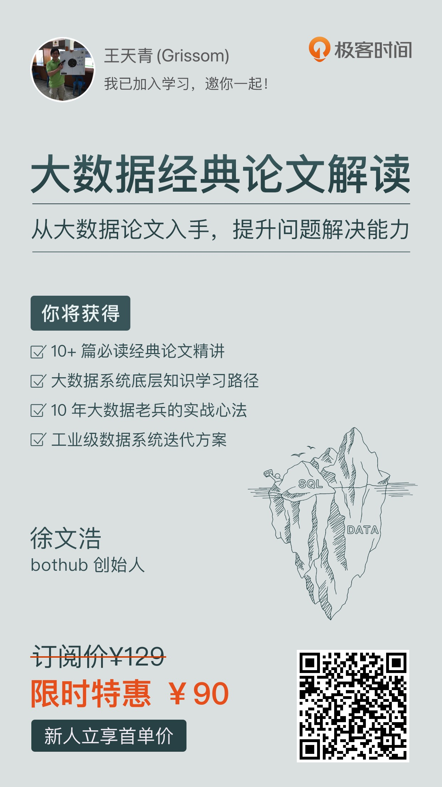

# 经典论文列表

本文档收录了大数据理论与实践领域的经典论文，按年份分类整理，涵盖分布式存储、计算框架、数据库系统等核心技术。

## 1. 论文概览

| 年份 | 技术/系统 | 论文标题 | 技术领域 |
|------|-----------|----------|----------|
| 2003 | **GFS** | `The Google File System` | [分布式文件系统](./gfs-sosp2003.pdf) |
| 2004 | **MapReduce** | `MapReduce: Simplified Data Processing on Large Clusters` | [分布式计算框架](./Dean%20和%20Ghemawat%20-%202008%20-%20MapReduce%20simplified%20data%20processing%20on%20large%20clu.pdf) |
| 2006 | **Bigtable** | `Bigtable: A Distributed Storage System for Structured Data` | [分布式数据库](./Chang%20等%20-%202008%20-%20Bigtable%20A%20Distributed%20Storage%20System%20for%20Structu.pdf) |
| 2006 | **Chubby** | `The Chubby lock service for loosely-coupled distributed system` | 分布式锁服务 |
| 2007 | **Thrift** | `Thrift: Scalable cross-language services implementation` | RPC 框架 |
| 2008 | **Hive** | `Hive: A warehousing solution over a map-reduce framework` | 数据仓库 |
| 2010 | **Dremel** | `Dremel: Interactive analysis of web-scale datasets` | 交互式查询引擎 |
| 2010 | **Spark** | `Spark: Cluster computing with working sets` | 内存计算框架 |
| 2010 | **S4** | `S4: Distributed stream computing platform` | 流计算平台 |
| 2011 | **Megastore** | `Megastore: Providing scalable, highly available storage for interactive services` | 分布式存储 |
| 2011 | **Kafka** | `Kafka: A distributed messaging system for log processing` | 消息队列系统 |
| 2012 | **Spanner** | `Spanner: Google's globally distributed database` | 全球分布式数据库 |
| 2014 | **Storm** | `Storm@Twitter` | 实时流处理 |
| 2014 | **Raft** | `In search of an understandable consensus algorithm` | 分布式一致性算法 |
| 2015 | **Dataflow** | `The dataflow model: A practical approach to balancing correctness, latency, and cost in massive-scale, unbounded, out-of-order data processing` | 流处理模型 |
| 2018 | **PolarFS** | `PolarFS: an ultra-low latency and failure resilient distributed file system for shared storage cloud database` | 云原生文件系统 |
| 2020 | **Delta Lake** | `Delta lake: high-performance ACID table storage over cloud object stores` | 数据湖存储 |
| 2021 | **Lakehouse** | `Lakehouse: A New Generation of Open Platforms for AI and Data Analytics` | 湖仓一体架构 |
| 2023 | **HTAP 综述** | `HTAP 数据库关键技术综述` | 混合事务分析处理 |
| 2024 | **云原生数据库综述** | `云原生数据库综述` | 云原生数据库 |
| 2024 | **Iceberg** | `Apache Iceberg: The Definitive Guide` | 表格式标准 |

## 2. 按技术领域分类

### 2.1 分布式存储系统

- **GFS (2003)**: `The Google File System`  
  Google 提出的分布式文件系统，为大规模数据存储奠定了基础。采用主从架构，通过数据分块和多副本机制保证可靠性和可扩展性，是现代分布式存储系统的开山之作。

- **Bigtable (2006)**: `Bigtable: A Distributed Storage System for Structured Data`  
  Google 的分布式结构化数据存储系统，采用稀疏、分布式、持久化的多维排序映射。为 NoSQL 数据库的发展提供了重要思路，影响了 HBase、Cassandra 等系统的设计。

- **Megastore (2011)**: `Megastore: Providing scalable, highly available storage for interactive services`  
  Google 开发的跨数据中心存储系统，在 Bigtable 基础上提供 ACID 事务支持。通过实体组概念平衡了一致性和可扩展性，为分布式事务处理提供了新思路。

- **PolarFS (2018)**: `PolarFS: an ultra-low latency and failure resilient distributed file system for shared storage cloud database`  
  阿里云提出的超低延迟分布式文件系统，专为云数据库设计。采用用户态网络和 RDMA 技术，实现了微秒级延迟，代表了云原生存储的技术发展方向。

### 2.2 分布式计算框架

- **MapReduce (2004)**: `MapReduce: Simplified Data Processing on Large Clusters`  
  Google 提出的分布式计算编程模型，将复杂的并行计算抽象为 Map 和 Reduce 两个阶段。极大简化了大规模数据处理的编程复杂度，催生了 Hadoop 生态系统的发展。

- **Spark (2010)**: `Spark: Cluster computing with working sets`  
  UC Berkeley 开发的内存计算框架，通过弹性分布式数据集（RDD）实现高效的迭代计算。相比 MapReduce 提供了更好的性能和更丰富的 API，成为大数据处理的主流框架。

- **S4 (2010)**: `S4: Distributed stream computing platform`  
  Yahoo! 开发的分布式流计算平台，采用 Actor 模型处理无界数据流。为实时数据处理提供了可扩展的解决方案，影响了后续流计算系统的设计。

- **Storm (2014)**: `Storm@Twitter`  
  Twitter 开源的实时流处理系统，提供低延迟、高可靠的流数据处理能力。通过 Topology 概念描述计算逻辑，支持至少一次和恰好一次的消息处理语义。

- **Dataflow (2015)**: `The dataflow model: A practical approach to balancing correctness, latency, and cost in massive-scale, unbounded, out-of-order data processing`  
  Google 提出的统一批流处理模型，通过窗口、触发器和累积模式等概念处理无界乱序数据。为 Apache Beam 等系统提供了理论基础，推动了流批一体化发展。

### 2.3 数据库系统

- **Spanner (2012)**: `Spanner: Google's globally distributed database`  
  Google 的全球分布式数据库，首次在全球范围内提供强一致性的分布式事务。通过 TrueTime API 和两阶段提交协议，解决了分布式系统中的时钟同步和一致性问题。

- **HTAP 数据库关键技术综述 (2023)**: `HTAP 数据库关键技术综述`  
  系统性总结了混合事务分析处理（HTAP）数据库的关键技术，包括存储引擎、查询优化、事务处理等方面。为理解现代数据库系统的发展趋势提供了重要参考。

- **云原生数据库综述 (2024)**: `云原生数据库综述`  
  全面分析了云原生数据库的架构特点、关键技术和发展趋势。涵盖存储计算分离、弹性扩缩容、多租户等核心概念，反映了数据库技术的最新发展方向。

### 2.4 数据仓库与分析

- **Hive (2008)**: `Hive: A warehousing solution over a map-reduce framework`  
  Facebook 开发的数据仓库软件，在 Hadoop 之上提供类 SQL 查询接口。通过 HiveQL 降低了大数据分析的门槛，使传统数据分析师能够利用 MapReduce 进行大规模数据处理。

- **Dremel (2010)**: `Dremel: Interactive analysis of web-scale datasets`  
  Google 的交互式大数据分析系统，采用列式存储和树形架构实现秒级查询响应。其嵌套数据模型和查询执行技术影响了 Apache Drill、Presto 等系统的设计。

- **Delta Lake (2020)**: `Delta lake: high-performance ACID table storage over cloud object stores`  
  Databricks 开源的存储层，在对象存储之上提供 ACID 事务、版本控制和 Schema 演进能力。通过事务日志机制解决了数据湖的可靠性问题，推动了湖仓一体化发展。

- **Lakehouse (2021)**: `Lakehouse: A New Generation of Open Platforms for AI and Data Analytics`  
  提出了湖仓一体化架构概念，结合数据湖的灵活性和数据仓库的性能优势。通过开放格式和标准化接口，为 AI 和数据分析提供统一的数据平台。

- **Iceberg (2024)**: `Apache Iceberg: The Definitive Guide`
  Apache Iceberg 的权威指南，详细介绍了这一现代表格式的设计理念和实现细节。Iceberg 通过快照隔离、Schema 演进等特性，为大规模分析工作负载提供了高性能的表格式标准。

### 2.5 系统基础设施

- **Chubby (2006)**: `The Chubby lock service for loosely-coupled distributed system`  
  Google 的分布式锁服务，为松耦合分布式系统提供粗粒度锁和可靠的小文件存储。采用 Paxos 算法保证一致性，为 GFS、Bigtable 等系统提供协调服务支持。

- **Thrift (2007)**: `Thrift: Scalable cross-language services implementation`  
  Facebook 开发的跨语言服务框架，支持多种编程语言间的高效通信。通过接口定义语言（IDL）和代码生成，简化了分布式服务的开发和部署。

- **Kafka (2011)**: `Kafka: A distributed messaging system for log processing`  
  LinkedIn 开发的分布式消息系统，采用发布-订阅模式处理大规模日志数据。通过分区和副本机制提供高吞吐量和容错能力，成为现代数据管道的核心组件。

- **Raft (2014)**: `In search of an understandable consensus algorithm`  
  相比 Paxos 更易理解的分布式一致性算法，通过领导者选举和日志复制保证集群一致性。其简洁的设计和清晰的状态转换使其被广泛应用于各种分布式系统中。

## 3. 阅读建议

### 3.1 基础必读

建议按以下顺序阅读基础论文：

1. **GFS (2003)** - 理解分布式文件系统的基本概念
2. **MapReduce (2004)** - 掌握分布式计算的核心思想
3. **Bigtable (2006)** - 学习分布式数据库的设计原理

### 3.2 进阶阅读

在掌握基础概念后，可以深入学习：

1. **Spark (2010)** - 内存计算框架的优化思路
2. **Spanner (2012)** - 全球分布式数据库的一致性保证
3. **Raft (2014)** - 分布式一致性算法的实现

### 3.3 前沿技术

关注最新的技术发展：

1. **Lakehouse (2021)** - 湖仓一体架构的设计理念
2. **云原生数据库综述 (2024)** - 云原生时代的数据库发展趋势
3. **Iceberg (2024)** - 现代数据湖的表格式标准

## 4. 相关资料

[**大数据经典论文解读**](https://time.geekbang.org/column/intro/100091101)

课程主体划分为以下 5 大模块。

- **基础知识篇**：从最经典的 Google 三驾马车 GFS、MapReduce 和 Bigtable 这三篇论文开始，帮你理解大数据系统面对的主要挑战，以及应对这些挑战的架构设计方法。进一步地，会带你一起来看大数据系统依赖的分布式锁 Chubby、序列化和 RPC 方案 Thrift，让你能够将架构设计和计算机结合到一起，掌握好计算机科学的底层原理。
- **数据库篇**：一方面来研读 Hive、Dremel 和 Spark 的相关论文，了解工程师们是怎么迭代改进 MapReduce，从而满足海量数据下的高性能分析需求。另一方面，你还会了解 Megastore 和 Spanner，从而明白如何在 Bigtable 的基础架构上，逐步添加 Schema、跨行事务，直至完成了一个跨数据中心的分布式数据库。
- **实时处理篇**：结合 Storm、Kafka 以及 Dataflow，你会了解到现代大数据的实时处理系统是怎么逐步迭代，做到流批一体，达成批量和实时数据处理的统一的。
- **资源调度篇**：通过解读 Raft、Borg 和 Kubernetes 的论文，你能够厘清如何尽可能在一个数据中心里，合理地压榨资源、调度系统。
- **实战应用篇**：学以致用，通过剖析 Facebook 数据仓库的逐步演进变化，以及 Twitter 如何使用大数据进行机器学习，你就能理解如何通过分析问题、理解架构，将所学到的大数据知识串联起来。这样你在未来面对新的问题时，也能够找到精巧的解决方案。
